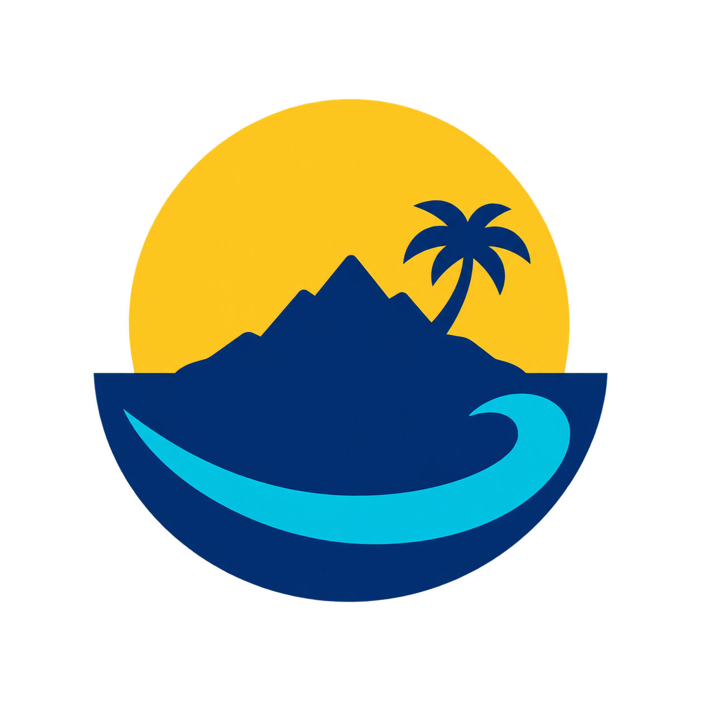

# Laughtale

<p align="center">
  
</p>

> 일정과 상황 때문에 접어야 했던 제품 경험을, 이번에는 끝까지 만들어 보는 개인 프로젝트입니다.

## 무엇을 만드는가

Laughtale은 서로 무관한 예제를 모아 둔 저장소가 아닙니다. 하나의 제품을 오래 키우면서
필요할 때마다 서비스와 인프라를 덧붙여 가는 작업장입니다.

이름은 만화 원피스의 마지막 섬 `Laugh Tale`에서 가져왔습니다. 도착지가 정해져 있다기보다,
가는 동안 쌓이는 항해 기록이 본체에 가깝다는 뜻으로 붙였습니다.

## 왜 만드는가

언젠가 중국의 배달 라이더들이 자기 지역의 콜을 잡으려고 화면을 쉴 새 없이 새로고침하는
영상을 봤습니다. 콜 하나가 뜨는 순간 수많은 사람이 동시에 그것을 선점하려고 달려들었습니다.
그 장면을 보다가 질문이 하나 생겼습니다. **제가 만든 서버와 기능은 저 순간을 버틸 수
있을까요?**

여기서 중요한 것은 대용량 트래픽 기술을 한번 써 보는 일이 아닙니다. 하나의 자원을 두고
수많은 사용자가 동시에 경쟁하는 극단적인 상황에서도 제품이 정확하고 공정하게 동작하는지가
핵심입니다. 동시성과 경합, 중복 처리, 선점의 공정성, 부하와 장애 상황에서의 대응까지 직접
설계하고 시험해 보려고 합니다.

또 하나의 이유는 미련입니다. 실무의 제품은 일정, 우선순위, 이미 존재하는 구조 안에서
완성됩니다. 그래서 "여기는 이렇게 했어야 했는데"가 남습니다. Laughtale은 그 아쉬움을 다시
꺼내서, 이번에는 제 기준과 관점으로 결론까지 밀어붙이는 자리입니다.

그래서 판단 기준도 하나뿐입니다. 기능을 빨리 늘리는 것이 아니라, 제가 실제로 쓰고 납득할
수 있는 제품 경험인지를 봅니다. 기술은 전시용으로 도입하지 않습니다. 제품에 필요한 이유가
생겼을 때 가장 작은 형태로 넣고, 실제 동작과 측정값을 보고 다음 구조를 정합니다.

## 현재 상태

**초기 구상 단계입니다. 실행 가능한 애플리케이션은 아직 없습니다.**

지금 저장소에 있는 것은 로고와 이 문서, 그리고 작업 규칙뿐입니다. 코드가 들어오는 시점에
필요한 환경, 실행 방법, 테스트 방법을 이 문서에 함께 적습니다.

## 앞으로 예상하는 모습

아래는 **계획이며 구현된 구조가 아닙니다.** 제품이 구체화되면서 달라질 수 있습니다.

```text
user
  └─ edge gateway
       ├─ apps/web                  Next.js frontend
       └─ services/<service-name>   독립적으로 배포되는 backend 서비스들
```

- Gateway가 외부 트래픽의 단일 진입점이 되고, 프런트엔드와 각 backend 서비스로 요청을
  전달합니다.
- backend 서비스는 하나의 기술로 통일하지 않습니다. 문제의 성격에 따라 FastAPI, Spring 등
  서로 다른 스택을 고를 수 있습니다.
- 서비스 경계는 처음부터 고정하지 않습니다. 실제 요구와 운영상의 필요가 생길 때 나눕니다.

앞의 질문에 답하려면 결국 경합과 부하를 실제로 재현해 봐야 합니다. Kubernetes, 서버 확장,
부하 테스트, DB primary/replica, Elasticsearch, Kafka, 용량 산정과 월간 인프라 비용 추정이
그때 꺼낼 목록입니다. 다만 시작부터 갖춰 둘 요구사항은 아닙니다. 제품이 그것을 필요로 하게
되었을 때 하나씩 들여옵니다.

## 원칙

> 구조는 제품을 돕기 위해 존재합니다. 아직 해결할 제품 문제가 없다면, 구조를 먼저 복잡하게
> 만들지 않습니다.
