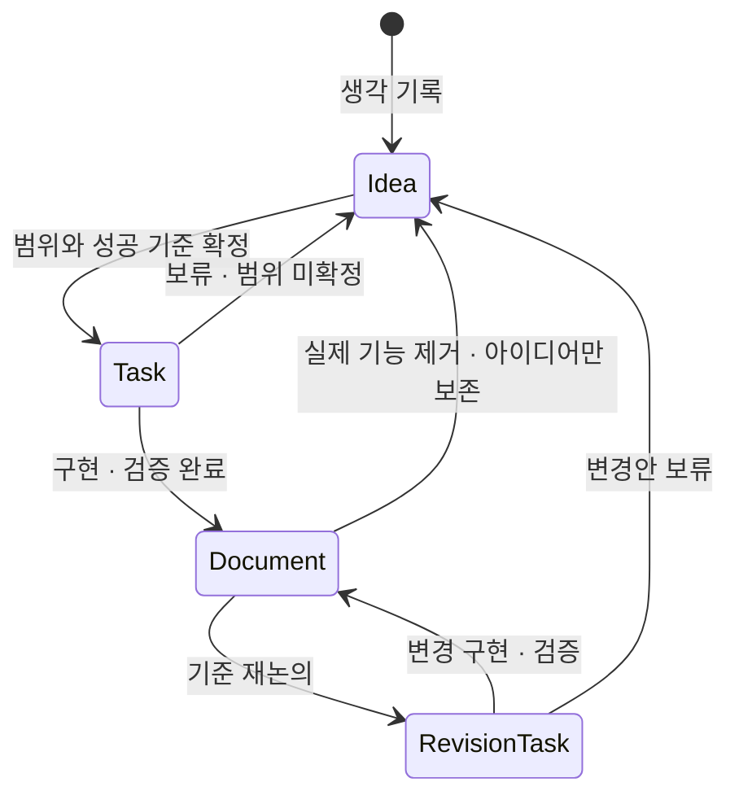
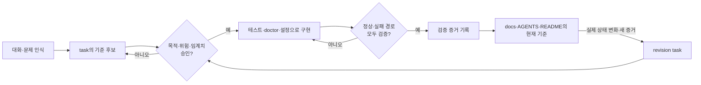
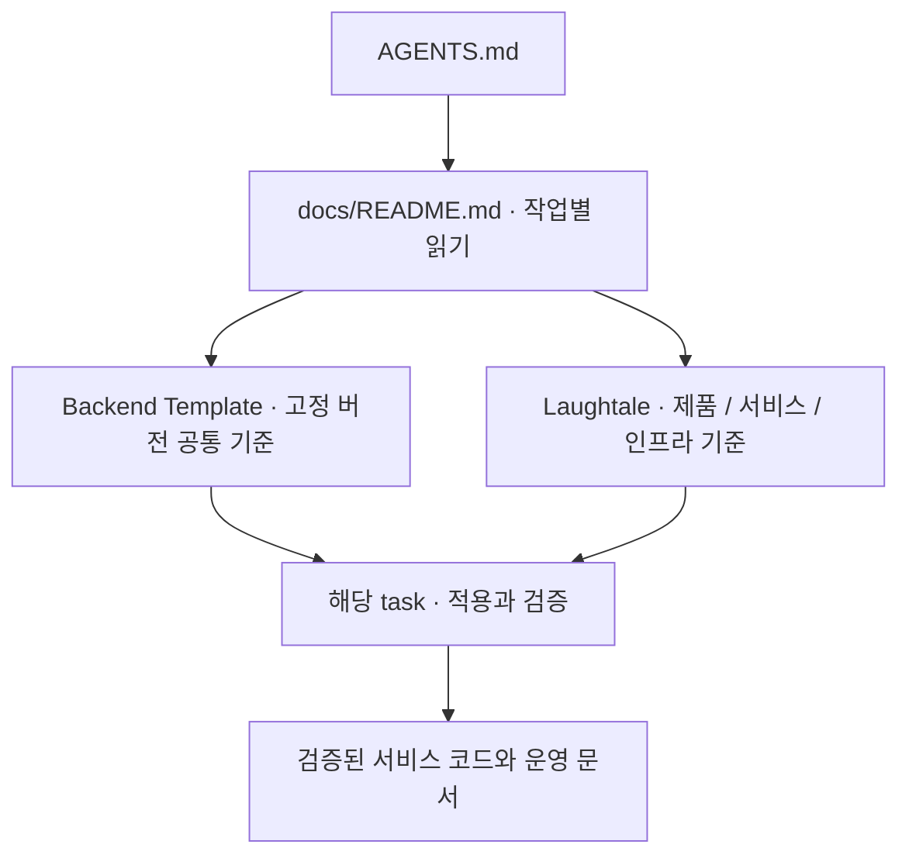

# Project Documents

이 디렉터리는 관리자가 승인한 프로젝트 규칙과 구현·검증을 마친 현재 시스템 기준을 보관합니다. 제안, 작업 체크리스트, 대화 정리는 `docs/`에 두지 않습니다.

개발 규칙은 승인 시 적용하지만, 문서에 규칙이 있다는 사실만으로 자동 검증이 구현되었다고
간주하지 않습니다. 시스템 구조와 운영 사실의 승격에는 아래 구현·검증 조건을 적용합니다.

## 문서 생명주기

| 위치 | 역할 | Source of truth 여부 | 종료 조건 |
| --- | --- | --- | --- |
| `.ideas/` | 확정 전 생각과 장기 후보 | 아니요 | 작업 범위가 확정되면 `tasks/`로 승격합니다. |
| `tasks/` | 현재 논의·구현·검증 중인 작업 | 아니요 | 완료하면 기준만 `docs/`로 승격하고 task는 삭제합니다. |
| `docs/` | 승인된 프로젝트 규칙·검증된 운영 지식 | 예 | 규칙이 변경되거나 실제 시스템에서 제거·대체될 때 갱신합니다. |
| `README.md` | 외부 사용자를 위한 소개와 빠른 실행 | 현재 공개 표면 | 프로젝트 사용법이 바뀔 때 갱신합니다. |
| `AGENTS.md` | 에이전트 라우팅과 작업 규칙 | 작업 규칙의 기준 | 프로젝트 협업 규칙이 바뀔 때 갱신합니다. |

## 대화에서 기준으로

대화에서 나온 내용은 바로 기준이 되지 않습니다. 관리자가 방향과 통과 조건을 승인하고, 그 조건을 실제로 검사할 수 있어야 프로젝트 기준으로 승격합니다.

구조·인프라·운영처럼 실패 비용이 큰 기준 후보는 다음을 명시합니다. 단순한 파일 생성이나 문구 수정에는 이 형식을 강제하지 않습니다.

| 항목 | 답해야 하는 질문 |
| --- | --- |
| 목적 | 이 기준이 보호하는 사용자 결과는 무엇입니까? |
| 위험 | 어떤 실패를 잡아내려는 것입니까? |
| 증거 | 테스트, HTTP 응답, 상태 조회 등 무엇으로 확인합니까? |
| 임계치 | 정확히 어느 상태부터 통과입니까? |
| 근거 | 사용자 결정, 공식 문서, 실측값 중 어디에서 왔습니까? |
| 재검토 조건 | 트래픽, 비용, 구조, 버전 중 무엇이 바뀌면 다시 보겠습니까? |

완료 하네스는 승인된 기준을 판정하는 수단이지, 기준의 타당성을 스스로 보장하지 않습니다. 하네스가 올바른 실패를 잡는지 확인하기 위해 의도적으로 깨진 상태를 만드는 negative control이나 장애 주입을 별도로 실행합니다.

## 승격 규칙

`tasks/` 문서는 다음 조건을 모두 만족할 때만 `docs/`로 승격합니다.

1. 결정이 승인되었습니다.
2. 실제 코드나 인프라에 반영되었습니다.
3. 성공 기준과 핵심 장애 경로를 검증했습니다.
4. 다음 작업에서도 반복해서 참고할 내용입니다.

승격할 때 task 전체를 복사하지 않습니다. 현재 구조, 운영 명령, 제약, 변경 기준만 남기고 작업 과정과 체크리스트는 버립니다. 정확한 설정값은 코드와 manifest를 가리킵니다.

## 재논의와 강등 규칙

현재 시스템이 기존 문서대로 동작하는 동안에는 문서를 바로 강등하지 않습니다.

1. `tasks/<change>.md`를 만들고 변경 이유와 성공 기준을 기록합니다.
2. 기존 `docs/` 문서는 현재 기준으로 유지하고 변경 task를 링크합니다.
3. 변경 구현과 검증이 끝나면 기존 문서를 갱신합니다.
4. 기존 기능이 실제로 제거되었다면 문서를 삭제합니다.
5. 제거한 내용을 미래 후보로 보존할 가치가 있을 때만 `.ideas/`로 요약해 강등합니다.

문서 내용이 현재 구현과 이미 다르다는 사실을 발견했다면 문서 상단을 `Status: review-needed`로 표시하고 수정 task를 만듭니다. 이때 실제 코드와 runtime 상태가 운영 사실의 기준입니다.

## 중복 방지

- 같은 작업에 `SPEC-*`, `plan.md`, `todo.md`를 따로 만들지 않습니다.
- 활성 작업 하나당 이름이 있는 `tasks/<work>.md` 하나만 사용합니다.
- 설명용 그래프는 해당 task나 canonical document 안에 둡니다.
- 완료된 task를 보관하기 위한 `archive/`는 만들지 않습니다. 과거 작업은 Git 이력을 사용합니다.
- `docs/` 파일이 세 개를 넘기기 전에는 하위 분류 디렉터리를 만들지 않습니다.

## 작업별 읽기

Laughtale은 제품·서비스 계약과 인프라·배포·통합 운영 결정을 소유합니다. 공통 백엔드 개발 기준은
고정된 [Backend Template](../external/backend-template/design/README.md)이 소유하며 이곳에 복제하지 않습니다.
변경 책임과 적용할 계약에 해당하는 문서만 선택하고 선택한 문서는 끝까지 읽습니다. 전체 폴더를 일괄 읽지 않습니다.

| 작업 | 읽을 정본 |
| --- | --- |
| 제품 방향·현재 범위 | [프로젝트 README](../README.md) |
| 논의·구현 중인 기능·인프라·K8s | [현재 task](../tasks/README.md)의 해당 문서 |
| 업무·Domain·DB·외부 연계·검증 | [공통 개발 원칙](../external/backend-template/design/engineering.md) |
| DI·초기화·종료·정합성·DB 확장 | [Backend 공통 설계](../external/backend-template/design/backend.md) |
| HTTP·API 변환, DB·외부 연계의 기존 세부 선택 | [서비스 계약 보완](service-contracts.md)의 해당 절 |
| 로그·계측·수집 안전·경보 판단 | [관측](../external/backend-template/design/observability.md) |
| 부하·GIL·GC·worker·용량·월 비용 | [Runtime Review](../external/backend-template/design/runtime-review.md) |
| 언어별 구현·테스트 | [구현별 안내](../external/backend-template/design/implementations/README.md)에서 대상 기술만 선택합니다. |

계측 도구 설치·배포·자동 확장은 해당 task에서 별도로 승인·검증합니다. 공통 계측 기준이 있다는 이유로
인프라를 설치하지 않습니다. 성능 시험의 환경·임계치·원시 결과·비용 가정은 해당 `tasks/<work>.md`에 남기고
반복 사용할 운영 사실만 이 문서의 생명주기에 따라 승격합니다. 아직 없는 운영 문서 폴더를 미리 만들지 않습니다.

## 공통 기준 버전과 변경

현재 채택 버전은 `dd2d3e7cf7cd7f8ee8a264a181fcce5823ed95ae`입니다(2026-09-08).
실제 적용 버전은 Git의 `external/backend-template` gitlink가 기준이며 `git submodule status`로 확인합니다.
설계 전용 초기 버전에서 FastAPI 설정·DI·로그·계측과 SQLite 예약·동시성·멱등성 예제를 제공하는 버전으로 갱신했습니다.

소비 경로 `external/backend-template/python/fastapi`에서 고정된 uv 0.12.10과 lock으로 의존성을 설치하고,
Ruff 검사·포맷 검사(65개 파일)·ty·pytest(95개 통과)·wheel/sdist 빌드를 재검증했습니다.
Starlette의 `BlockingPortal` deprecated alias 경고 1건은 원본에 명시된 허용 경고이며 그대로 표시됩니다.
검증 명령은 [구현 사용 안내](../external/backend-template/python/fastapi/README.md#빌드와-검증)가 소유합니다.
컨테이너·모니터링 기동, 공유 DB 변경, 서비스 코드 복사와 skill 설치는 이번 갱신에 포함하지 않았습니다.
PostgreSQL·채팅·인증·WebSocket·운영 부하 검증은 별도이며 SQLite 예제의 통과로 대체하지 않습니다.
작성 중인 상위 저장소 가이드는 포함하지 않았으며 커밋 후 별도 채택합니다.

- 문서가 없으면 [README의 초기화 명령](../README.md#저장소-준비와-문서)을 실행합니다. 형제 디렉터리나 원격 main으로 대체하지 않습니다.
- 공통 변경은 Backend Template에서 리뷰한 뒤 채택할 커밋의 차이·서비스 영향·검증을 확인하고 gitlink를 별도로 갱신합니다. 기본 절차에 `update --remote`를 사용하지 않습니다.
- 같은 적용 범위의 충돌은 숨기지 않습니다. 명시적으로 승인한 프로젝트 예외만 우선하며 이유·범위·재검토 조건은 해당 로컬 문서에 남깁니다.
- 기존 규칙 중 고정 버전이 아직 담지 않은 세부 선택은 [서비스 계약 보완](service-contracts.md)에만 남깁니다. 이후 공통 정본에서 대응을 확인하면 보완을 제거합니다.
- 소스 복사·실행 코드 재사용·라이선스 판단·skill 설치는 문서 참조와 별도 작업입니다.

## TDD 적용 상태

TDD는 조사·실험 후보이며 현재 의무 개발 방식이 아닙니다. 설치된 설계 스킬이 후속 TDD 스킬을
지시하더라도 자동 적용·설치하지 않습니다. 테스트 작성 순서의 의무화는 별도 승인하며 검증 증거는 공통 개발 기준을 따릅니다.
