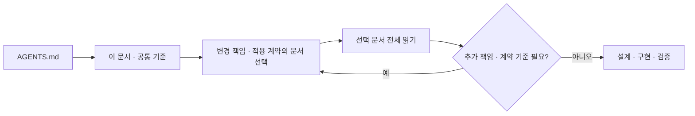

# 개발 규칙 — 공통 원칙과 문서 라우팅

Laughtale에서 설계·구현·리뷰에 적용하는 승인된 규칙입니다. 자동 검사가 모두 구현되었다는 뜻은 아닙니다.
이 파일은 공통 원칙과 읽기 경로를 소유하고, 상세 규칙은 아래 문서가 각각 소유합니다.

## 작업별 선택 읽기

1. 이 진입점을 읽고 변경하는 책임 또는 적용하는 계약·불변조건의 소유 문서를 선택합니다. 소유 계층의 코드를 직접 수정하지 않아도 그 기준을 사용하는 작업이면 읽습니다. 디렉터리 전체를 일괄 로드하지 않습니다.
2. 선택한 문서는 끝까지 읽습니다. 문서의 「함께 읽을 조건」이나 위 선택 기준에 해당하는 추가 책임·계약을 발견하면 그 소유 문서를 읽습니다.
3. 코드 구현·테스트·완료 판정에는 Testing도 읽습니다. 단순 문구 수정·아이디어 논의에 모든 개발 규칙을 요구하지 않습니다.

| 작업·검색어 | 상세 규칙의 소유 문서 |
| --- | --- |
| endpoint, Router, Controller, Request/Response DTO, HTTP 오류, cursor | [HTTP API](engineering/http-api.md) |
| use case, Service, Facade, Validator, Job, Internal DTO | [Application](engineering/application.md) |
| Model, 불변조건, 상태 전이, Enum, 금액, 시간, 실험 정책 | [Domain](engineering/domain.md) |
| Repository, ORM, query, migration, transaction, 경합, outbox | [Persistence](engineering/persistence.md) |
| 외부 API/SDK, 외부 통신 Port/Adapter, Client, timeout, retry, DI | [외부 연계](engineering/external-integrations.md) |
| test, fixture, smoke, 격리, 회귀, 완료 증거, TDD 적용 상태 | [Testing](engineering/testing.md) |
| 성능·용량 설계, runtime, GIL, GC, worker, 메모리, 부하·병목 판단 | [Runtime Review](engineering/runtime-review.md) |
| 서비스 신설, metrics, 요청·Job·외부 연계 계측, 대시보드·경보·자동 확장 | [Metrics](engineering/metrics.md) |

예를 들어 API 응답 필드명만 바꾸면 HTTP API와 Testing을 읽고, 날짜·금액의 변환을 다루면 Domain도 읽습니다.
외부 호출과 DB 반영을 함께 바꾸면 외부 연계·Application·Persistence·Testing을 읽습니다. 새 용어를 찾을 때는
`rg -n '키워드' docs/engineering`으로 위치를 좁힌 뒤 해당 문서를 읽습니다.

## 공통 경계

- 각 backend 서비스는 독립 프로젝트이며 언어·도구·폴더명은 문제에 맞게 선택합니다. 대문자 Service는 프로세스 안의 업무 계층이며 독립 배포되는 backend 서비스와 구분합니다.
- Domain은 DB·HTTP client·프레임워크·외부 DTO를 알지 못합니다. Application은 필요한 Port 계약에 의존하고 외부 구현이 그 계약을 구현합니다. Port는 현재 업무가 요구하는 행위만 정의합니다.
- Adapter는 경계 구현의 총칭입니다. 입력은 Router/Job, DB 출력은 Repository 구현, 외부 통신 출력은 외부 API Adapter로 구분합니다. Client 위임 규칙은 마지막 경우에 적용합니다.
- 책임 구분은 클래스·계층의 개수 요구가 아닙니다. 함수·모듈·언어 표준 기능을 활용하고 실제 책임·중복 없이 wrapper·getter/setter·공통 상속·factory·DI container를 추가하지 않습니다.

## 코드와 공통 안전 기준

- 이름은 수행하는 업무를 표현합니다. `claim_call()`처럼 작성하며 목적이 불명확한 `process()`·`handle()`은 피합니다. 프레임워크 callback 이름은 유지합니다.
- Python 업무 메서드·변수는 `snake_case`를 사용하며 내부용이라는 이유로 `_`·`__` 접두사를 붙이지 않습니다. `__init__` 등 언어 프로토콜·라이브러리 요구는 예외이며 다른 언어는 해당 규약을 따릅니다.
- 입력·반환 타입을 명시합니다. Python은 `T | None`, 혼동하기 쉬운 여러 인자는 keyword-only를 사용합니다. `Any`·타입 검사 예외는 필요한 외부 경계 등으로 한정하고 이유를 남깁니다.
- Python import는 패키지 기준 절대 경로를 기본으로 하며 공개 API 재노출에는 상대 import를 허용합니다. 업무 이유·예외 조건은 한국어 docstring이나 가까운 주석으로 설명하고 이름을 반복하지 않습니다.
- 이벤트 루프 기반 async 코드에서 동기 I/O로 루프를 막지 않으며 순수 계산에 불필요한 async를 붙이지 않습니다.
- 예외는 복구·번역·작업 격리 책임이 있는 위치에서 처리합니다. 광범위한 catch는 최상위 처리·자원 정리처럼 근거가 있는 경계에 한정하며 실패를 정상 결과로 숨기지 않습니다.
- 환경별 값·endpoint·인증 정보는 configuration으로 주입합니다. secret을 저장소에 넣지 않으며 로그·오류·정책 추적에 인증 정보·개인정보·전체 요청 본문을 기록하지 않습니다.

## 설계·확장·변경

- 설계가 필요한 작업은 `tasks/<work>.md`에 기능 소유권, 상태·불변조건, 원자성, 외부·데이터 계약, 정상·실패·경합 완료 기준을 정합니다. 작고 자명한 변경에 별도 설계 문서나 빈 계층을 만들지 않습니다.
- 새 서비스·브로커·검색·캐시는 제품 요구·운영 문제 또는 명시적인 학습 실험 목적이 있을 때 도입합니다. 새 의존성의 해결 문제·유지 비용을 설명하고 확장은 트래픽·지연·오류·자원 측정 및 월간 비용 가정과 연결합니다.
- 관리자의 명시적인 변경 결정이 우선합니다. 예외는 해당 작업에 이유·범위를 남기고 지속적인 변경은 해당 규칙의 소유 문서를 수정합니다. 서비스별 설정·명령은 그 서비스의 코드·문서가 소유합니다.
- 상세 본문을 진입점·다른 문서·agent adapter에 복제하지 않습니다. 문서 생명주기는 [docs 안내](README.md)를 따르고 자동 검증의 적용 상태는 실제 검사와 실패 경로 검증을 마친 뒤 기록합니다.
