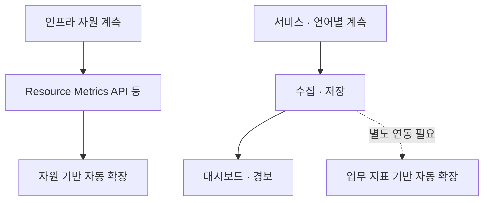

# Metrics — 서비스 공통 계측 기준

Status: 2026-09-07 사용자 요청으로 채택한 프로젝트 공통 개발 규약입니다.
계측 라이브러리·수집기·대시보드·자동 확장이 구현되었다는 뜻은 아닙니다.
공통 개발 기준은 [진입점](../engineering-principles.md)을 따릅니다.

## 적용 범위와 책임

서비스 신설, 요청·Job·외부 연계 흐름 변경, 계측·대시보드·자동 확장을 설계하거나 검증할 때 읽습니다.
FastAPI·Spring 등 언어와 프레임워크에 관계없이 적용하되 해당 서비스에 없는 책임은 이유와 함께 제외합니다.
순수 계산 함수마다 metric을 추가하거나 무관한 변경에서 전체 문서를 읽도록 강제하지 않습니다.

인프라 자원 API, 앱 계측, 장기 저장·시각화는 별도 책임입니다. 지표 노출만으로 수집·경보·자동 확장이
완성되지 않습니다. Metrics Server·Prometheus·Grafana·OpenTelemetry 등은 선택지이며 일괄 설치 의무가 아닙니다.

## 기본 관측 범위

| 대상 | 해당 서비스에서 정의할 지표 |
| --- | --- |
| 자원·런타임 | CPU·메모리/RSS·재시작·OOM과 실행 모델에 맞는 이벤트 루프 지연·GC·throttling 등의 필요한 항목입니다. 각 항목의 원천과 수집 경로를 구분합니다. |
| 요청·작업 | 처리 건수·지연 분포·성공·실패·거절·취소·결과 불명을 구분합니다. HTTP는 경로 template·메서드·결과별로, Job은 제한된 작업 유형별로 측정합니다. |
| 의존성 | DB/외부 호출·연결 풀 획득·잠금 대기·timeout·재시도를 필요에 따라 분리합니다. |
| 포화·복구 | 큐 깊이·가장 오래된 작업의 대기 시간·활성 연결·상한 도달·재처리와 복구 시간을 해당 흐름에 맞게 정의합니다. |
| 업무 결과 | 저장·결제·발송 등 무엇이 완료인지 정의하고 요청 성공과 구분합니다. metric counter를 업무 원장이나 정합성 증명의 대체물로 사용하지 않습니다. |

지표마다 이름·단위·타입(counter/gauge/histogram 등)·증가/감소 시점·허용 label·집계 범위를
해당 서비스 코드나 명세에 한 번 정의합니다. 지연은 측정 시작/끝과 histogram 경계를 명시하고,
p95/p99 등을 비교할 때 표본 수·구간·실패 및 거절을 함께 봅니다. 인스턴스별 percentile을 단순 평균하지 않습니다.

## 안전한 수집과 운영

- 사용자·대화방·메시지·요청 ID, 원문 URL, 본문, 토큰, 비밀값과 무제한 오류 문자열은 metric label에 넣지 않습니다. label 조합 수를 제한하고 상세 추적은 접근 통제된 별도 진단 경로로 분리합니다.
- `/metrics` 등 수집 endpoint는 내부 접근으로 제한하며 공개 Gateway에 기본 노출하지 않습니다. 수집 인증·네트워크·TLS 정책을 명시하고 오류 해결을 위해 검증을 임의 해제하지 않습니다.
- scrape/export 주기·보관 기간·저장 한도·수집기 자원 예산을 배포 전에 정합니다. 계측 실패가 업무 결과를 바꾸지 않도록 격리하고, 무한 대기·무제한 buffer를 허용하지 않습니다.
- 다중 worker/Pod의 수집·합산과 재시작 시 counter reset을 고려합니다. 자동 계측과 수동 계측이 같은 사건을 이중 집계하지 않도록 책임을 정합니다.
- 수집 실패·지표 부재·오래된 표본은 0이나 정상으로 표시하지 않습니다. 예상 수집 주기에 맞춰 관측 경로 자체의 건강도 확인합니다.
- 경보·자동 확장 지표는 사용자 영향과 연관성을 설명하고 임계치·지속 시간·대응 주체를 정합니다. 자원 API와 custom/external metrics 경로를 구분하며 지표 존재만으로 자동 확장 동작을 주장하지 않습니다.

## 검증과 문서 소유권

알려진 건수의 정상·실패·거절·재시도를 주입해 값과 분류를 확인합니다. 수집 단절·필수 값 누락을
정상으로 판정하지 않는지, 다중 프로세스 집계·label 상한·계측 비용도 검사합니다.
업무 정확성은 원장·DB·계약 테스트로 별도 검증하고, 계측 검증과 실제 자동 확장 검증을 구분합니다.

- 이 문서는 공통 계측 원칙을 소유합니다. 서비스별 지표·도구·수치는 해당 `tasks/<work>.md`와 코드에서 정합니다.
- 부하 가설·실험 조건·성능 판정은 [Runtime Review](runtime-review.md), 테스트 실행·격리는 [Testing](testing.md)을 따릅니다.
- 실제 배포 설정과 검증된 운영 지식만 [문서 생명주기](../README.md)에 따라 승격합니다. 미구현 지표·없는 doctor·실행하지 않은 검사는 명시합니다.
