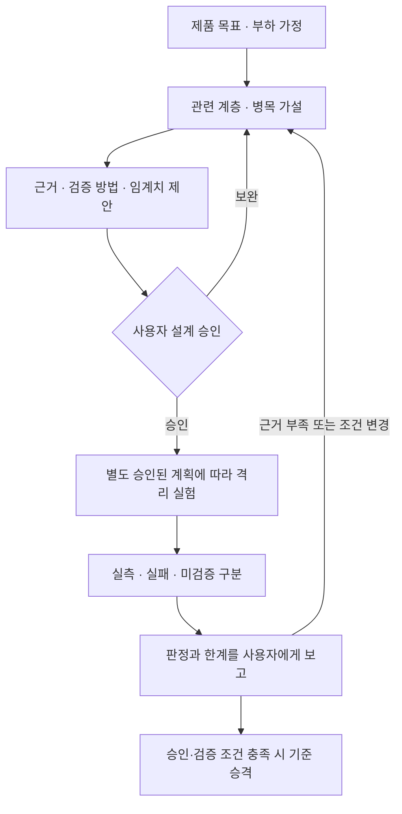

# Runtime Review — 성능·용량 판단 하네스

Status: 문서 기반 설계·리뷰 규약입니다. 자동 doctor·벤치마크·성능 게이트는 구현되지 않았습니다.
공통 기준은 [개발 규칙 진입점](../engineering-principles.md), 승인·승격 절차는
[문서 생명주기](../README.md)를 따릅니다. 이 규약이 개별 제품 설계나 실행을 승인하지 않습니다.

## 언제 읽습니까?

성능·용량 목표를 정하거나, 언어·런타임·동시 실행 모델을 선택하거나,
worker·메모리·연결 풀·큐·확장 구성을 바꾸는 설계와 리뷰에서 읽습니다.
일반 문구 수정이나 무관한 기능에 전체 분석을 요구하지 않습니다.
아래 계층 중 해당 경로에 영향을 주는 것만 고르고 제외한 계층은 이유를 한 줄로 남깁니다.

## 검토할 계층

| 계층 | 판단 질문 | 증거 후보 |
| --- | --- | --- |
| 업무·부하 | 요청률·동시 연결·데이터 크기·읽기/쓰기 비율·특정 키 집중도가 어떻게 됩니까? 어떤 정합성을 지켜야 합니까? | 정상·피크·폭주 시나리오, 지연·오류·정확성 목표입니다. |
| 언어·런타임 | 실제 버전·빌드에서 GIL, 이벤트 루프, GC, 객체 할당이 이 경로에 어떤 영향을 줍니까? | 런타임 설정, CPU/할당 프로파일, 이벤트 루프 지연, GC 정지 시간입니다. |
| 프로세스·OS | worker별 메모리·스레드·연결 풀과 CPU/메모리 제한을 합산했습니까? | RSS, CPU throttling, 파일 디스크립터, 프로세스/연결 수입니다. |
| DB·외부 I/O | 계산과 대기 중 무엇이 병목입니까? 특정 키 경합이나 외부 지연이 전파됩니까? | 쿼리·잠금·풀 대기 시간, 외부 지연·오류, 재시도량입니다. |
| 과부하·복구 | 어디서 유입을 제한하고, 대기열이 차거나 연결이 끊기면 어떻게 동작합니까? | 큐 깊이와 가장 오래된 작업의 대기 시간, 거절률, 재접속·복구 시간입니다. |

GIL·GC 같은 용어를 적는 것만으로 검토 완료로 보지 않습니다. 구현체·버전·빌드·사용 라이브러리에
맞는 공식 근거를 확인하고, 그것이 해당 제품 경로에 영향을 준다는 가설은 실측 사실과 구분합니다.

## 작업에 남길 최소 기록

기존 `tasks/<work>.md`에 아래 표를 채우거나 이미 있는 해당 절을 링크합니다.
별도 보고서·ADR·중복 체크리스트를 의무로 만들지 않습니다.

| 항목 | 기록할 내용 |
| --- | --- |
| 목표·위험 | 사용자 결과, 예상 부하와 편중, 지켜야 할 정확성, 허용 지연·오류를 적습니다. |
| 가설·선택 | 예상 병목, 현재 선택, 비교할 대안과 유지 비용을 적습니다. 보편적 언어 우열로 결론 내리지 않습니다. |
| 근거·환경 | 공식 출처 URL·확인일·적용 버전, 코드 revision, 런타임/빌드, CPU·메모리 제한, worker·풀 설정을 적습니다. |
| 실험·판정 기준 | 재현 명령·대상·데이터·부하 방식·워밍업·지속 시간·반복 횟수·측정 구간과 통과 임계치를 실행 전에 정합니다. 아직 없는 명령은 미구현으로 표시합니다. |
| 결과·한계 | 원시 결과 위치, 관측값, 판정, 미검증 범위와 재검토 조건을 적습니다. 용량을 비용으로 환산하면 수요·가격 가정과 실측을 분리합니다. |

임계치가 미정이면 사용자가 승인할 후보와 이유를 제시합니다. 임의의 수치를 프로젝트 공통 기준으로
고정하지 않으며, 결과를 본 뒤 조용히 임계치를 낮추지 않습니다.

## 검증과 판정

- 상태는 `미검증`, `통과`, `실패`, `판정 불가`, `해당 없음(이유)`으로 구분합니다. 설계 승인은 성능 통과가 아닙니다.
- 처리량은 유입·성공·오류·거절을 구분하고 지연은 표본 수·측정 구간과 p95/p99 등을 함께 봅니다. 성공 응답만 골라 과부하를 숨기지 않습니다.
- 부하 생성기 자체의 CPU·네트워크 한계와 부하 방식도 확인합니다. 측정 환경이나 반복 결과가 비교 가능하지 않으면 개선을 단정하지 않습니다.
- 속도가 개선되어도 누락·중복·권한·순서 등의 승인된 불변조건을 깨면 실패입니다. 로컬 결과를 다른 배포 환경이나 더 큰 규모의 보장으로 일반화하지 않습니다.
- 자동 판정기를 만들 때는 필수 측정값 누락을 통과로 처리하지 않습니다. 임계치 초과·위반 결과를 주입하는 negative control로 실패 감지를 검증합니다.
- 실험 격리·실행 권한·검증 증거는 [Testing](testing.md)을 따릅니다. 운영·공유 자원 부하 실험과 비용 발생은 문서 작성 권한에 포함되지 않습니다.

## 문서와 실행 도구의 경계

계측의 정의·수집 안전·집계·누락 판정은 [Metrics](metrics.md)를 따릅니다.

이 문서는 무엇을 질문하고 어떤 근거로 판단할지 소유합니다. 재현 스크립트와 실제 명령은
해당 기능의 테스트·벤치마크가 소유하고, 작업 문서는 실행 결과를 링크합니다.
자동화는 측정·누락 검사·승인된 임계치 비교를 담당하며 설계의 타당성과 사용자 승인을 대신하지 않습니다.
실제 자동 하네스 구축은 별도 명세와 승인을 거칩니다. 현재 존재하지 않는 CLI나 검사를 호출하도록 지시하지 않습니다.
