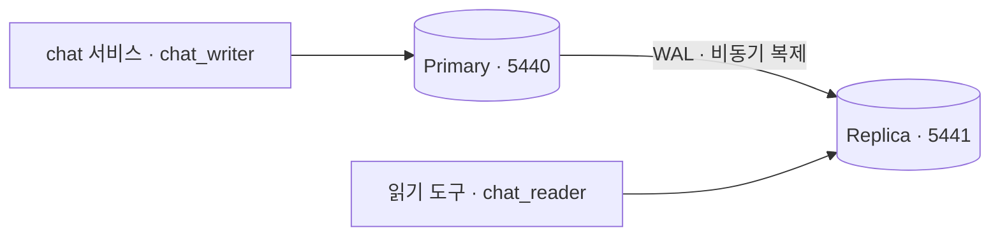

# PostgreSQL Primary / Replica 실험

2026-09-08 사용자 승인으로 만든 라프텔 전용 로컬 실험 환경입니다. 머신의 공용 DB 재사용 원칙에 대한 이번 실험 한정 예외이며, `thready-postgres`와 다른 프로젝트는 변경하지 않습니다.

## 현재 구성

| 대상 | Host 접속 | 역할 |
| --- | --- | --- |
| Primary | `127.0.0.1:5440/laughtale_chat` | 쓰기·최신 조회 |
| Replica | `127.0.0.1:5441/laughtale_chat` | 비동기 복제·읽기 전용 |



두 서버 모두 같은 Docker VM에 있습니다. K8s 내부 DB나 머신 장애를 견디는 HA가 아닙니다.
PostgreSQL 16.15의 같은 이미지 digest를 고정했습니다. 정확한 자원·포트·WAL 설정은 `compose.yaml`이 소유합니다.
각 DB는 CPU 0.5개·256MiB 한도이며 최초 검증 후 메모리는 약 33MiB/13MiB였습니다. 유휴 순간값이며 부하 용량 추정이 아닙니다.
Replica는 테스트 DB가 아닙니다. Primary의 DB·역할·스키마를 물리 복제합니다.

## 계정과 소유권

| 역할 | 권한 |
| --- | --- |
| `postgres` | 컨테이너 내부 socket 관리용. Host HBA는 이 계정을 허용하지 않습니다. |
| `chat_owner` | NOLOGIN DB·`chat` schema 소유자. migration 시 명시적 `SET ROLE` 경로가 필요합니다. |
| `chat_writer` | 연결·schema 사용·테이블 SELECT/INSERT/UPDATE/DELETE·sequence 사용. DDL/관리 권한은 없습니다. |
| `chat_reader` | 연결·schema 사용·테이블 SELECT만 허용합니다. |
| `chat_replicator` | 복제 전용 LOGIN/REPLICATION이며 앱에서 사용하지 않습니다. |

`chat_owner`가 `chat` schema에 만드는 테이블에 default privileges가 적용됩니다. 다른 역할이 만든 테이블에는 자동 적용되지 않습니다.
권한과 별개로 Replica는 recovery 중이므로 writer 계정으로 연결해도 쓰기를 거절합니다. 역할 자체는 양쪽에 복제됩니다.
복제 계정은 물리 WAL을 읽을 수 있으므로 단순 조회 계정보다 민감하게 관리합니다.

## 시작과 중지

아래 Compose 명령은 저장소 루트에서 실행합니다.

```sh
docker compose --env-file infra/postgres/.env -f infra/postgres/compose.yaml config --quiet
docker compose --env-file infra/postgres/.env -f infra/postgres/compose.yaml up -d --wait --wait-timeout 90
docker compose --env-file infra/postgres/.env -f infra/postgres/compose.yaml ps
# 전체 중지: volume과 데이터를 유지합니다.
docker compose --env-file infra/postgres/.env -f infra/postgres/compose.yaml stop
```

`.env`는 Git 제외이며 mode 600입니다. 이 머신에는 독립적인 난수 비밀번호를 생성했습니다.
새 checkout에서는 `.env.example`을 `.env`로 복사하고 각 키에 별도 `openssl rand -hex 24` 결과를 넣고 `chmod 600`을 적용합니다. 비밀번호가 포함될 수 있는 `docker compose config` 전체 출력을 공유하지 않습니다.
앱의 `services/chat/.env`에는 writer 비밀번호로 Primary URL을 설정합니다. 실제 값은 문서·Git에 넣지 않습니다.

초기 SQL은 빈 Primary volume에서만 실행합니다. 기존 volume이 있으면 `.env`만 바꿔도 DB 비밀번호가 바뀌지 않습니다. 회전 절차는 별도 작업입니다.
Replica는 첫 시작에 `pg_basebackup -R -X stream`으로 초기화하며 기존 volume을 자동 지우지 않습니다. 중간 실패로 데이터가 남으면 수동 확인을 요구합니다.
두 named volume을 지우는 명령은 일반 중지·복구 절차에 포함하지 않습니다.

## 검증

서비스 개발 의존성을 설치한 뒤 저장소 루트에서 실행합니다.

```sh
uv tool run --from uv==0.12.10 uv sync --project services/chat --locked --group dev
uv tool run --from uv==0.12.10 uv run --project services/chat --locked python infra/postgres/verify.py
# 새로 만든 실험 Replica만 중지하고, 그 사이 쓰기가 재시작 후 반영되는지 확인합니다.
uv tool run --from uv==0.12.10 uv run --project services/chat --locked python infra/postgres/verify.py --restart-replica
```

컨테이너 project/service label·loopback 포트·recovery 상태·동일 system identifier를 먼저 확인합니다.
최적화 실행(`python -O`)은 검증 assertion 생략을 막기 위해 작업 전에 거절합니다.
현재 실행의 UUID가 붙은 probe 테이블만 만들고 종료 시 삭제합니다. 기존 업무 데이터와 다른 서버는 건드리지 않습니다.
20초 따라잡기 제한은 smoke 중 무한 대기 방지용이며 운영 지연 SLO가 아닙니다.

2026-09-08 검증 결과:

- `pg_stat_replication`: `chat_replica / streaming / async`입니다.
- Primary의 commit을 Replica에서 확인했습니다. rollback한 행은 Primary에 남지 않았습니다.
- reader 쓰기·reader/writer DDL은 SQLSTATE 42501, Replica에서 writer의 쓰기는 25006으로 거절했습니다.
- Replica 중지 중 Primary 쓰기 성공, 기존 volume으로 재시작 후 데이터 따라잡기를 확인했습니다.
- 실제 Primary에 chat 앱 lifespan·Session DI로 연결하고 DB/계정/Primary 여부와 종료 시 engine 참조 제거를 확인했습니다.

상태 확인은 다음 명령을 사용합니다. healthcheck는 Primary의 준비와 Replica의 recovery 상태만 확인하므로 복제 streaming 확인을 대신하지 않습니다.

```sh
docker compose --env-file infra/postgres/.env -f infra/postgres/compose.yaml exec -T primary \
  psql -U postgres -d laughtale_chat -X -c "SELECT application_name,state,sync_state,sent_lsn,replay_lsn FROM pg_stat_replication;"
docker compose --env-file infra/postgres/.env -f infra/postgres/compose.yaml exec -T primary \
  psql -U postgres -d laughtale_chat -X -c "SELECT slot_name,active,wal_status,pg_wal_lsn_diff(pg_current_wal_lsn(),restart_lsn) AS retained_bytes FROM pg_replication_slots;"
```

## 테스트 DB

앱 통합 시험은 같은 Primary 안의 `laughtale_chat_test` DB와 독립적인 `chat_test` 역할을 사용합니다. 새 인스턴스는 만들지 않습니다. 이 역할은 테스트 DB에만 연결·schema 생성 권한을 가지며 superuser·DB 생성·역할 생성·복제 권한은 없습니다.
이는 논리적 데이터 격리입니다. 테스트 DB도 Replica에 물리 복제되며 개발 DB와 자원을 공유하므로 성능·장애 격리를 주장하지 않습니다.

새 checkout에서는 Git 제외 `services/chat/.env.test`에 아래 키를 설정하고 `chmod 600 services/chat/.env.test`를 적용합니다. `<독립 난수 비밀번호>`는 URL-safe 난수로 교체합니다. 실제 값은 출력·커밋하지 않습니다.

```dotenv
CHAT_TEST_DATABASE_URL=postgresql+asyncpg://chat_test:<독립 난수 비밀번호>@127.0.0.1:5440/laughtale_chat_test
```

저장소 루트에서 최초 한 번 실행합니다. 기존 DB나 역할이 있으면 변경 없이 실패합니다. 중간 실패 시 남은 상태를 확인하며 자동 삭제하지 않습니다.

```sh
uv tool run --from uv==0.12.10 uv run --project services/chat --locked python infra/postgres/prepare-test.py
```

도구는 대상 컨테이너·포트·Primary를 확인하고 DB/역할을 생성한 뒤 lab HBA를 reload합니다. `.env.test`만 수정해도 기존 DB 비밀번호가 바뀌지는 않습니다. 시험 실행 명령은 [서비스 안내](../../services/chat/README.md#검증)를 따릅니다.
시험은 고유 `run_<uuid>` schema만 정리합니다. 프로세스 강제 종료 시 남을 수 있으므로 다음 실행이 다른 schema를 일괄 삭제하지 않습니다.

## 한계와 다음 작업

- 비동기 복제이므로 직후 조회에 지연이 있고 Primary 유실 시 미복제 commit이 사라질 수 있습니다. 자동 승격은 없습니다.
- slot의 WAL 보관 상한은 256MB이며 전체 디스크 사용의 엄격한 상한이 아닙니다. 중단이 길어 WAL이 제거되면 새 base backup이 필요할 수 있습니다. 자동 데이터 삭제·재초기화는 하지 않습니다.
- TLS·운영 백업/PITR·경보·실제 장애 전환은 미구현입니다. 복제는 백업이 아니며 삭제도 복제됩니다.
- 앱은 Primary만 연결합니다. Replica 읽기 라우팅과 메시지 업무·migration은 후속입니다. 기반 트랜잭션·timeout·취소 시험은 테스트 DB에서 검증했습니다.
- `.env`·컨테이너 환경은 Docker/로컬 관리자에게 보일 수 있습니다. 로컬 loopback 개발 구성이지 운영 secret 배포 모델이 아닙니다.

근거: [PostgreSQL 16 streaming replication](https://www.postgresql.org/docs/16/warm-standby.html), [pg_basebackup](https://www.postgresql.org/docs/16/app-pgbasebackup.html), [hot standby](https://www.postgresql.org/docs/16/hot-standby.html). 확인일: 2026-09-08.
