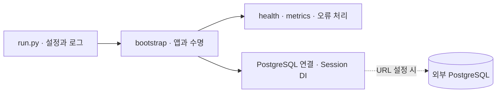

# Chat service

채팅 서비스의 FastAPI 공통 기반입니다. 메시지 저장·WebSocket·인증은 아직 구현하지 않았습니다.

## 출처와 소유권

`external/backend-template/python/fastapi`의 `dd2d3e7cf7cd7f8ee8a264a181fcce5823ed95ae`에서 가져왔습니다.
이 서비스의 수정은 Laughtale이 소유합니다. 원본 업데이트를 자동 덮어쓰거나 런타임 import하지 않습니다.
원본에 재사용 라이선스가 아직 없으며, 이번 복사는 소유자의 명시적 요청으로 진행했습니다. 제3자에게 별도 라이선스 권한을 부여한다는 의미는 아닙니다.

DI·앱 조립·수명·오류·로그·HTTP/DB metrics 기반과 공통 회귀 시험을 가져왔습니다.
인사·예약·상품 seed·SQLite migration은 제품 기능에서 제외했습니다. 공통 HTTP 회귀 시험용 인사 endpoint는 `tests/app.py`에만 있습니다.
SQLite 전용 시험은 PostgreSQL 검증으로 간주하지 않으며 원본에서 유지됩니다.

## 구조



`src/chat_service/`는 실행 코드, `tests/`는 검증입니다. 서버·DB 배포 구성이 아니라 논리적 흐름입니다.
공통 설계 정본은 [Backend Template](../../external/backend-template/design/README.md), 제품 설계는 [채팅 task](../../tasks/linky-chat-internal-dm.md)가 소유합니다.

## 설치·실행

아래 명령은 `services/chat/`에서 실행합니다. 전역 uv는 변경하지 않습니다.

```sh
uv tool run --from uv==0.12.10 uv sync --locked
cp -n .env.example .env
lsof -nP -iTCP:18082 -sTCP:LISTEN
uv tool run --from uv==0.12.10 uv run --locked python -m chat_service.run
```

포트가 사용 중이면 소유 프로세스를 종료하지 말고 `.env`의 `SERVER_PORT`를 변경합니다.
기본 loopback이며 종료는 Ctrl+C입니다. `/`, `/health/live`, `/health/ready`, `/metrics`, `/docs`를 제공합니다.
`DB_PRIMARY_URL`이 비어 있으면 DB 없는 기반 smoke 모드입니다. 채팅이 동작한다는 뜻이 아닙니다.
URL이 있으면 시작 시 연결을 확인하고 종료 시 engine을 해제합니다. readiness는 시작 준비 완료이며 지속적인 DB 건강 검사는 아닙니다.

## PostgreSQL 준비

SQLAlchemy async engine + asyncpg를 사용합니다. URL·계정은 로컬 설정으로 전달합니다.
SQLite URL은 거절하며 PRAGMA·BEGIN IMMEDIATE를 사용하지 않습니다. 각 작업이 `session.begin()`으로 원자적 경계를 소유하고 DI는 자동 commit하지 않습니다.
연결 timeout·pool 획득 timeout·서버 statement/lock timeout은 별도 설정입니다. 값은 초기 개발 기본값이며 성능 검증된 운영 예산이 아닙니다.
URL query 옵션은 현재 거절합니다. TLS·운영 연결 정책은 외부 배포 전에 별도로 설계합니다.

새 DB 컨테이너·공유 DB·테이블을 생성하지 않습니다. 서비스용 5433 및 테스트용 5434의 `laughtale_chat` 논리 DB는 실제 대상 확인·생성 승인 후 준비합니다.
메시지 schema와 Alembic migration은 후속입니다. 실제 PostgreSQL의 commit·rollback·잠금·취소 검증 전에는 DB 전환 검증 완료로 보지 않습니다.
DB 오류의 업무별 재시도·공개 응답 매핑도 메시지 트랜잭션 도입 시 검증합니다. 임의 자동 재시도는 없습니다.

구현 근거: [SQLAlchemy 비동기 engine](https://docs.sqlalchemy.org/en/20/orm/extensions/asyncio.html), [asyncpg 연결 인자](https://magicstack.github.io/asyncpg/current/api/index.html#asyncpg.connection.connect). 확인일: 2026-09-08.

## 검증

```sh
uv tool run --from uv==0.12.10 uv run --locked ruff check .
uv tool run --from uv==0.12.10 uv run --locked ruff format --check .
uv tool run --from uv==0.12.10 uv run --locked ty check
uv tool run --from uv==0.12.10 uv run --locked pytest -q
uv tool run --from uv==0.12.10 uv build
```

기본 테스트는 공유 DB·개인 `.env`를 사용하지 않습니다. 실제 Uvicorn 종료 시험은 임시 loopback 포트와 자체 생성 프로세스만 사용합니다.
2026-09-08: 58개 테스트·Ruff·포맷·ty·wheel/sdist 빌드 통과를 확인했습니다. PostgreSQL engine 설정 시험은 접속 없는 조립 검증이며 실제 DB 통합 시험은 아직 없습니다.
템플릿에서 상속한 Starlette deprecated alias 경고는 숨기지 않고 표시합니다.
Docker·K8s·복제·샤딩·Sentry·대규모 부하 시험은 이번 기반 도입에 포함하지 않습니다.
