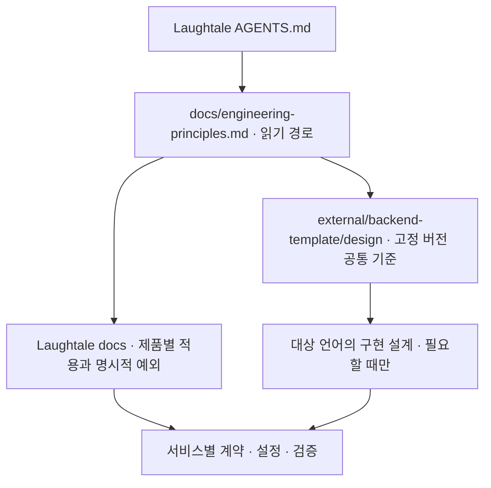

# Backend Template 개발 기준 의존

Status: spec-review · 사용자 검토 전 설계안 · 2026-09-07

## 목적과 범위

Laughtale의 백엔드 개발 기준은 `Dae-Jeong/backend-template`의 정본을 참조하고, 여기에는 제품·서비스별 적용과 예외만 남기는 구조를 제안합니다. 이번 단계는 설계이며 submodule 추가나 기존 규칙 삭제는 아직 수행하지 않습니다.
실행 코드 import, 서비스 생성, DB·인프라 설치, 설치형 skill 동기화는 범위 밖입니다.

## 제안 구조

`external/backend-template/`를 Git submodule로 연결하는 안입니다. 형제 디렉터리의 개인 경로나 원격 main의 최신 상태에 의존하지 않고, Laughtale이 채택한 Git 커밋을 고정합니다.
최초 검토 기준은 [7f306c5](https://github.com/Dae-Jeong/backend-template/tree/7f306c5a1a0cec5d38d709a4b958bdcab8a20da3)이며 최종 채택 커밋은 연결 시 확인합니다. 이 시점에는 설계만 있고 실행 가능한 템플릿은 없습니다.

| 내용 | 정본 소유자 |
| --- | --- |
| 책임·DI·자원 수명·정합성·DB 확장 전략 | Backend Template의 `design/backend.md` |
| 업무·영속화·외부 연계의 공통 개발 판단 | Backend Template의 `design/engineering.md` |
| 로그·계측, 런타임·성능·용량 판단 | Backend Template의 관측·Runtime Review 문서 |
| 언어별 구체 구현과 템플릿 검증 | Backend Template의 `design/implementations/` |
| 제품 방향·문서 생명주기·서비스 API·배포 구성·실측값 | Laughtale의 해당 소유 문서 |
| 공통 기준과 다른 프로젝트 선택 | Laughtale의 명시적 예외: 이유·범위·재검토 조건 |

## 읽기와 변경 계약

- 에이전트는 Laughtale 진입점에서 변경 책임을 찾고 고정된 공통 문서와 해당 로컬 보완만 읽습니다. 전체 submodule 문서를 일괄 읽지 않습니다.
- 동일 규칙을 양쪽에서 병행 관리하지 않습니다. 공통 규칙 수정은 Backend Template에서 리뷰한 뒤 Laughtale의 고정 커밋을 별도 갱신합니다. 상위 저장소 변경이 즉시 적용되지는 않습니다.
- 적용 범위가 같은 공통 규칙과 로컬 문서가 충돌하면 임의로 선택하지 않습니다. 명시적으로 승인된 프로젝트 예외만 우선하며 미분류 충돌은 검토 대상으로 남깁니다.
- 기존 `docs/engineering/`의 규칙을 조항별로 대조합니다. 대응되는 규칙만 참조로 바꾸며, 누락된 세부 기준은 공통 보완 또는 프로젝트 예외로 분류하기 전까지 삭제하지 않습니다. TDD 적용 상태와 기존 task의 절 링크도 보존합니다.
- submodule이 없으면 초기화가 필요하다고 보고합니다. 형제 저장소나 인터넷 최신 문서를 몰래 대체 기준으로 사용하지 않습니다.
- 새 clone과 기존 clone의 초기화 방법은 README에 안내합니다. 업데이트는 변경 계약·영향받는 서비스·검증 증거를 확인한 뒤 수행하며 자동 최신 추적은 하지 않습니다.

## 구현 순서와 완료 기준

1. 사용자가 이 의존 방향·경로·업데이트 방식을 확인합니다.
2. 공개 HTTPS URL로 submodule을 연결하고 채택 커밋을 고정합니다. README 초기화 안내를 추가합니다.
3. 진입점과 책임별 문서를 대조하여 공통 참조와 프로젝트 보완으로 정리합니다. 규칙 의미가 바뀌면 별도로 확인받습니다.
4. 링크·고정 버전·깨끗한 clone의 초기화·Mermaid를 검증하고 완료된 기준만 docs로 승격합니다.

| 검증 | 통과 조건 |
| --- | --- |
| 버전 | `.gitmodules`와 gitlink가 의도한 공개 저장소·커밋을 가리킵니다. |
| 재현 | 별도 임시 clone에서 문서에 안내한 초기화로 같은 커밋과 참조 파일을 얻습니다. |
| 의미 보존 | 기존 규칙마다 공통 대응 또는 로컬 보완이 확인되며 미분류 삭제가 없습니다. |
| 라우팅 | AGENTS·docs·기존 task의 링크가 유효하고 불필요한 전체 읽기를 요구하지 않습니다. |
| 격리 | Backend Template의 인계된 main 작업·Laughtale 서비스·인프라를 변경하지 않습니다. |

예정 검증 명령은 `git submodule status`, `git ls-files --stage external/backend-template`, `git diff --check`입니다. submodule 구현 후 README의 clone·초기화 명령도 실제 실행하여 확인합니다. 현재 이 검증들은 미실행입니다.
