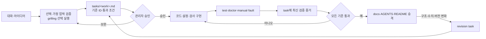

# Criteria Governance

Status: proposed

## 목표

대화에서 합의한 개발·구조·운영 기준을 실행 가능한 검사와 연결하고, 검증을 통과한 현재 상태만 SoT로 승격하는 최소 구조를 정합니다.

문서 형식 자체가 목적이 아닙니다. 에이전트가 다르더라도 같은 기준을 찾고, 같은 검사로 판정하며, 완료를 임의로 선언하지 못하게 하는 것이 목적입니다.

## 현재 상태

- 문서 생명주기와 승격·강등 규칙은 [`docs/README.md`](../docs/README.md)에 있습니다.
- K3s 작업의 완료 게이트와 검증 증거 형식은 [`tasks/k3s-bootstrap.md`](k3s-bootstrap.md)에 있습니다.
- 아직 실행 가능한 `doctor`와 반복 검증 규칙은 구현되지 않았습니다.

## 합의 구조

`grilling`은 모든 작업에 자동 적용하지 않습니다. 되돌리기 비싼 결정을 스트레스 테스트하거나 관리자가 명시적으로 요청했을 때만 task 승인 전에 사용합니다.

## 기준 레코드

실패 비용이 큰 기준은 task의 하나의 표에 다음 필드로 기록합니다.

| 필드 | 역할 |
| --- | --- |
| `id` | task·검사·증거를 잇는 안정적인 키입니다. 예: `k8s.route.http` |
| `outcome` | 보호해야 할 사용자·운영 결과입니다. |
| `risk` | 이 기준이 잡아낼 실패입니다. |
| `pass` | 통과로 판정할 관찰 가능한 상태나 임계치입니다. |
| `verify` | 단일 명령, 테스트, 또는 `manual`입니다. |
| `basis` | 관리자 결정, 공식 문서, 실측값 중 판정 근거입니다. |
| `review-trigger` | 트래픽·비용·구조·버전 중 재검토를 시작할 변화입니다. |

실행 증거는 기준 정의와 분리합니다. task가 활성인 동안에만 `checked-at`, `commit`, `id`, `verdict`를 기록하고, 승격할 때는 최신 검증 시점만 SoT에 남깁니다. 전체 이력은 Git과 향후 CI 로그가 소유합니다.

## 검증 수단의 경계

| 수단 | 책임 | 상태 변경 |
| --- | --- | --- |
| test·lint·build | 코드와 정적 산출물을 검증합니다. | 없음 |
| `scripts/doctor.sh` | 현재 로컬 환경과 실행 경로를 읽기 전용으로 점검합니다. | 없음 |
| manual | 화면·사용성처럼 현재 자동 판정할 수 없는 결과를 확인합니다. | 없음 |
| fault·negative control | 복원력과 하네스의 실패 탐지력을 검증합니다. | 있음·일상 doctor에서 분리 |

범용 `negative-control.sh`나 별도의 machine-readable schema는 지금 만들지 않습니다. 같은 패턴이 세 작업 이상에서 반복되거나 실제 드리프트가 발생했을 때 추출합니다.

## Claude·Codex 비교

| 주제 | Claude 제안 | Codex 판단 | 채택 |
| --- | --- | --- | --- |
| 문서 구조 | 새 문서 종류 없이 현재 4계층 유지 | 동의 | 예 |
| 연결 방식 | 기준 ID로 task·doctor·증거 연결 | 동의 | 예 |
| task 상태 | `draft/active/verified/canonical/revising` 통합 | task·검증·문서 상태가 섞임 | 아니오 |
| 증거 보관 | `docs/`에 누적하다 분리 | SoT가 다시 작업 로그가 됨 | task에 최신값만 저장 |
| negative control | 범용 script 추가 | 첫 반복 전에는 과함 | task별 장애 검증으로 시작 |
| grill skill | `grilling` 하나만 upstream 그대로 사용 | 동의 | 예 |

## Grilling 도입

Checked: 2026-09-05

- Source: [`mattpocock/skills` — `grilling`](https://github.com/mattpocock/skills/tree/main/skills/productivity/grilling)
- 설치: `.agents/skills/grilling/`에 project-local copy로 관리합니다.
- 연결: Claude Code·Qwen Code는 각 전용 경로의 symlink로, Codex·Gemini CLI는 공용 `.agents/skills/`로 읽습니다.
- 잠금: 도입을 보류합니다. Skill dependency·lock 관리는 아이디어이며 현재 설치·실행의 필수 조건이 아닙니다.
- 재검토: skill 본문을 업데이트할 때 diff를 확인하고 문서 생명주기·질문 방식과의 충돌을 다시 검토합니다.
- 적용: 관리자가 `grill`, `grill-me`, `stress-test`를 명시했을 때 task 승인 전에 실행합니다.
- 산출물: 질문 세션 문서를 따로 만들지 않고, 확정된 결정만 기존 task에 기록합니다.
- 제외: `grill-me` alias는 단독 실행 로직이 없어 설치하지 않습니다. `grill-with-docs`와 `domain-modeling`은 `CONTEXT.md`·ADR 구조가 현재 생명주기와 충돌하여 제외합니다.

## 작업 체크리스트

### Task 1. 기준 형식 검증

목표:
K3s task의 현재 완료 게이트를 기준 레코드 형식으로 표현해 불필요한 필드와 누락된 필드를 확인합니다.

예상 결과:
- [ ] 기준 ID가 중복 없이 부여됩니다.
- [ ] 각 기준의 목적·위험·통과 조건·검증법이 구분됩니다.
- [ ] 수치나 구조가 바뀔 때의 재검토 조건이 있습니다.

### Task 2. 최소 doctor 연결

목표:
K3s 구현 중 반복할 읽기 전용 검사만 `scripts/doctor.sh`에 연결합니다.

예상 결과:
- [ ] `doctor`가 상태를 변경하지 않습니다.
- [ ] 실패한 기준 ID와 이유를 출력합니다.
- [ ] 모든 검사 통과 시 exit code 0, 하나라도 실패 시 0이 아닌 코드를 반환합니다.

### Task 3. 하네스 실패 탐지력 검증

목표:
상태 변경이 필요한 장애 주입을 일상 doctor와 분리하고, 하네스가 알려진 실패를 탐지하는지 확인합니다.

예상 결과:
- [ ] 장애 주입 전에 변경 대상과 복구 방법을 알 수 있습니다.
- [ ] 알려진 실패 상태에서 관련 기준이 실패합니다.
- [ ] 복구 후 동일 기준이 다시 통과합니다.

## 완료 조건

- [ ] 관리자가 기준 레코드와 `grilling` 적용 경계를 승인했습니다.
- [ ] K3s task의 완료 게이트가 승인된 형식으로 갱신되었습니다.
- [ ] 최소 `doctor`가 구현되고 정상·실패 경로를 탐지합니다.
- [ ] 검증한 규칙만 `docs/README.md`와 `AGENTS.md`에 남고 이 task는 삭제됩니다.

## 열린 판단

- 기준 ID 명명은 첫 K3s 기준 변환 과정에서 가독성을 확인한 뒤 확정합니다.
- machine-readable manifest와 CI 연결은 반복 증거가 생기기 전까지 보류합니다.
