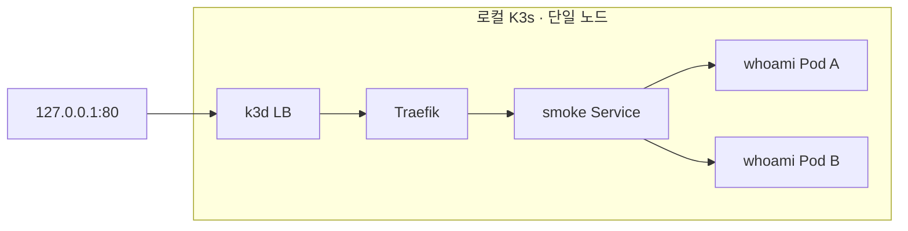
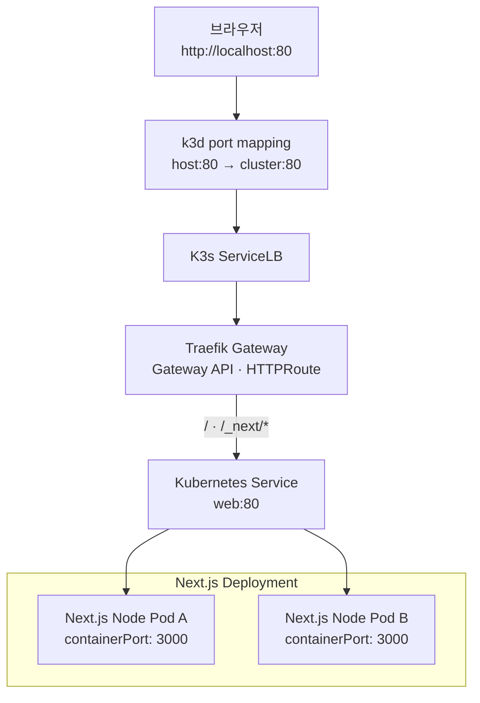
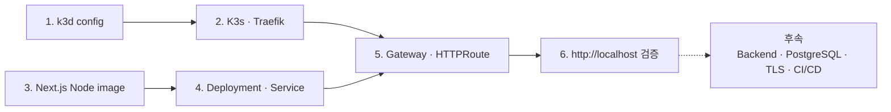
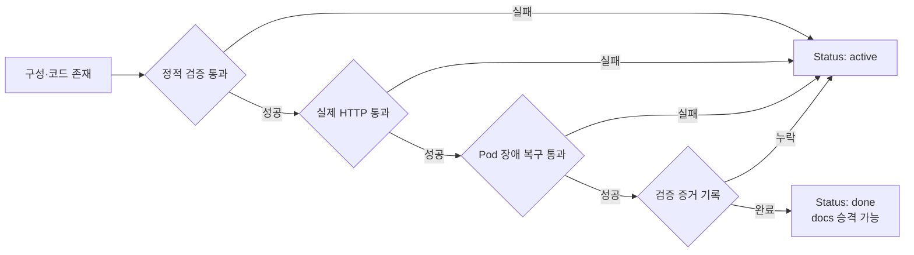

# Local K3s Bootstrap

Status: active — 최소 인프라 smoke test 검증 완료입니다. 아래 Next.js 최종 범위는 후속입니다.

## 2026-09-07 실행 범위

사용자가 승인한 첫 실행은 단일 노드 K3s와 Traefik을 통해 테스트 앱 2개에 접속하는 것입니다.
Next.js 구현, Gateway API 전환, DB, Kafka, 대시보드, HPA, 고부하 시험은 이번 실행에서 제외합니다.
기존 설계의 Gateway API 대신 이번 smoke test에만 기본 Ingress를 사용합니다.
호스트 바인딩은 외부 노출을 피하기 위해 127.0.0.1:80/443으로 제한합니다. TLS는 아직 설정하지 않습니다.
Docker 자원 설정과 기존 4개 서비스는 변경하지 않습니다. 클러스터 서버 메모리 상한은 1536MiB입니다.

1. `infra/k3d/cluster.yaml`을 검증하고 별도 context로 클러스터를 생성합니다. Node Ready를 확인합니다.
2. `infra/k8s/smoke.yaml`을 적용합니다. 테스트 Pod 2개 Ready와 HTTP 200을 확인합니다.
3. 테스트 Pod 1개를 정상 삭제하고 대체 Pod를 확인합니다. 저빈도 요청의 실패 수를 기록합니다.
4. Metrics API와 기존 Docker 서비스 상태를 확인합니다. 결과는 이 절에 남깁니다.



이는 채팅 성능이나 노드 장애 내성을 증명하지 않습니다. 메모리 압박 또는 기존 서비스 영향이
발견되면 추가 배포·부하 시험을 중단합니다. TDD 후속 스킬은 프로젝트 예외에 따라 적용하지 않습니다.

### Smoke 실행·점검 명령

```bash
# 최초 생성에만 사용합니다. 이미 존재하는 클러스터를 재생성하지 않습니다.
k3d cluster create --config infra/k3d/cluster.yaml --servers-memory 1536m
kubectl --context k3d-laughtale-local apply -f infra/k8s/smoke.yaml
bash scripts/infra-smoke-check.sh
# 사용하지 않을 때 이 클러스터만 중지합니다. 데이터 삭제는 하지 않습니다.
k3d cluster stop laughtale-local
k3d cluster start laughtale-local
```

생성 도구는 k3d 5.9.0입니다. K3s는 설치된 kubectl 1.34.1과 minor를 맞춰 1.34.10으로 고정합니다.
서버 컨테이너 상한은 생성 명령의 `--servers-memory`가 소유하며 Docker VM 전체 자원과는 다릅니다.
Pod 2개는 같은 노드에 있습니다. 정상 Pod 삭제 복구는 강제 종료·노드 장애·WebSocket 무중단을 증명하지 않습니다.
whoami는 요청 헤더를 응답하는 진단 도구이므로 실제 인증 정보나 사용자 트래픽을 보내지 않습니다.
k3d의 내부 serverlb는 Nginx 기반 전달 계층이며, 별도의 애플리케이션용 Nginx 배포는 없습니다.

참고 (2026-09-07 확인): [k3d config](https://k3d.io/stable/usage/configfile/),
[K3s 1.34](https://docs.k3s.io/release-notes/v1.34.X),
[whoami](https://github.com/traefik/whoami).

### Smoke 검증 결과 — 2026-09-07 16:38 KST

| 확인 | 결과 |
| --- | --- |
| 정적 검증 | namespace 생성 후 server dry-run, `bash -n`, `git diff --check` 통과했습니다. 최초 dry-run은 namespace가 아직 없어 namespaced 리소스를 검사하지 못했습니다. |
| 클러스터 | Node Ready, MemoryPressure/DiskPressure/PIDPressure 모두 False입니다. |
| 라우팅 | 호스트 `http://127.0.0.1/`와 `/health` HTTP 200입니다. Traefik 3.7.8과 Ready Endpoint 2개를 확인했습니다. |
| 복구 | Pod `smoke-58db4856d9-jjxkn`을 일반 삭제했습니다. 삭제 전후 100회 순차 GET 요청 실패 0회이며, 요청 사이 200ms를 두었습니다. 일정 도착률 부하 시험은 아닙니다. |
| 새 인스턴스 | 삭제 UID `c507a7da-dc70-42df-a9b1-57dbcfc7a4b0`와 다른 UID `e47d646e-1600-4cea-8be1-01084af9f39e`의 Pod가 Ready입니다. 기존·삭제·대체 Pod에 각각 54/3/43회 응답이 분산되었습니다. |
| 반복 점검 | `bash scripts/infra-smoke-check.sh`를 복구 전후 실행해 exit 0을 확인했습니다. |
| 계측 | Metrics API 조회 성공, 마지막 Node 메모리 751Mi, 테스트 Pod 5~6Mi입니다. 순간 측정값이며 용량 기준이 아닙니다. |
| 기존 서비스 | 기존 Docker 컨테이너 4개는 재시작 없이 실행 중입니다. 기존 앱 기능 전체 회귀 검증은 하지 않았습니다. |

초기 Traefik 설치는 CRD 준비 전 두 차례 재시도한 뒤 정상 완료했습니다. 최초 호스트 접속에서
connection reset이 발생했으나 내부 LB→Traefik→앱 HTTP 200을 확인하고 새로 만든
`k3d-laughtale-local-serverlb`만 재시작한 뒤 해결했습니다. 원인은 아직 확정하지 않았으며,
재현 시 호스트 바인딩·LB 내부·Service 경로를 나눠 검사합니다. Docker 전체를 재시작하지 않습니다.
진단용 18081 port-forward는 종료했습니다. 기존 kubeconfig에는 context가 없었으며 생성 후
첫 context인 `k3d-laughtale-local`이 current로 등록됐습니다. 운영 명령은 여전히 context를 명시합니다.

아래의 Next.js, Gateway API, 이미지 빌드와 전체 완료 게이트는 미실행입니다.

## 목표

macOS의 Docker Desktop 위에 단일 노드 k3d/K3s 클러스터를 만들고, K3s 기본 Traefik의 Gateway API를 통해 Next.js Node 서버까지 실제 HTTP 요청이 도달하는 최소 실행 경로를 준비합니다.

## 확정한 선택

- Frontend는 Next.js App Router를 Node 서버 모드로 실행합니다.
- 외부 reverse proxy는 K3s 기본 Traefik을 사용합니다.
- 별도의 Nginx 컨테이너는 사용하지 않습니다.
- 로컬 클러스터는 k3d로 만들고 호스트의 80·443을 클러스터의 80·443에 연결합니다.
- package manager는 현재 설치된 pnpm을 사용합니다.
- Backend와 PostgreSQL은 실제 첫 기능을 정할 때 추가합니다.

## 요청 흐름



Traefik은 외부 요청을 받을 Service를 선택하고, Next.js Node 서버는 HTML, React asset, Server Component 응답을 생성합니다.

## 이번 범위



Backend, PostgreSQL, HTTPS 인증서, GHCR, CI/CD, HPA는 이번 범위에 포함하지 않습니다. 실제 기능 없이 빈 Backend를 미리 만들지 않습니다.

## 실행 명령

```bash
brew install k3d
k3d cluster create --config infra/k3d/cluster.yaml
kubectl --context k3d-laughtale-local get nodes
kubectl --context k3d-laughtale-local get pods --all-namespaces
```

## 변경 경계

- 모든 `kubectl` 명령은 `k3d-laughtale-local` context를 명시합니다.
- 클러스터 삭제·재생성, Docker Desktop 자원 변경, 운영 서버·DNS·방화벽·인증서 변경은 먼저 확인합니다.
- 개인 kubeconfig, credential, TLS private key를 저장소에 넣지 않습니다.
- K3s image에 `latest` tag를 사용하지 않습니다.

## 작업 체크리스트

### Task 1. 로컬 클러스터 정의

목표:
버전이 고정된 k3d cluster config와 K3s 기본 Traefik의 Gateway API 활성화 구성을 작성합니다.

예상 결과:
- [ ] `laughtale-local` 단일 노드 cluster 정의가 존재함
- [ ] 호스트 80·443과 클러스터 80·443의 port mapping이 명시됨
- [ ] K3s image version과 Gateway API 활성화 설정이 재현 가능하게 저장됨
- [ ] k3d config schema와 사용 port를 검증함

### Task 2. 클러스터 생성

목표:
k3d를 설치하고 config에서 로컬 K3s 클러스터를 생성합니다.

예상 결과:
- [ ] `k3d-laughtale-local` context가 존재함
- [ ] server node가 `Ready` 상태임
- [ ] Traefik과 필수 `kube-system` Pod가 정상 동작함
- [ ] 기존 Docker workload와 다른 Kubernetes context가 변경되지 않음

### Task 3. Next.js Node 애플리케이션

목표:
`apps/web`에 pnpm 기반 Next.js App Router 애플리케이션과 실제 Laughtale 첫 화면을 만듭니다.

예상 결과:
- [ ] lint와 production build가 통과함
- [ ] `/`와 `/healthz`가 성공함
- [ ] Nginx 없이 Next.js Node 서버가 HTML과 asset을 제공함

### Task 4. Container runtime

목표:
Next.js standalone output을 linux/arm64 container image로 실행할 수 있게 구성합니다.

예상 결과:
- [ ] multi-stage container build가 존재함
- [ ] non-root Node 프로세스가 3000번 포트에서 실행됨
- [ ] container 단독 실행에서 `/healthz`가 성공함

### Task 5. Kubernetes workload와 Gateway

목표:
Next.js Deployment·Service와 Traefik Gateway·HTTPRoute를 연결합니다.

예상 결과:
- [ ] Next.js Pod가 readiness를 통과함
- [ ] `web` Service가 Ready Endpoint만 가리킴
- [ ] Gateway와 HTTPRoute condition이 `Accepted`임
- [ ] Kustomize build가 성공함

### Task 6. End-to-end와 복구 검증

목표:
브라우저 요청 경로와 Kubernetes의 기본 self-healing을 실제로 확인합니다.

예상 결과:
- [ ] `http://localhost`에서 Laughtale 화면이 응답함
- [ ] `/healthz`가 Traefik 경유로 성공함
- [ ] Next.js Pod 하나를 삭제해도 replacement Pod가 생성되고 서비스가 복구됨
- [ ] `./scripts/doctor.sh`가 변경 없이 반복 실행되며 exit code 0을 반환함

## 완료 판정



다음 게이트가 모두 성공해야 task를 완료로 판정합니다. 파일 존재나 agent의 완료 선언만으로는 통과하지 않습니다.

| 게이트 | 판정 방법 | 통과 기준 |
| --- | --- | --- |
| Frontend 정적 검증 | pnpm lint와 production build | 모든 명령의 exit code가 0임 |
| Container 검증 | image build와 단독 `/healthz` 요청 | non-root container가 정상 실행되고 HTTP 200을 반환함 |
| Cluster 검증 | 명시적 context로 Node와 system Pod 조회 | Node가 `Ready`이고 필수 Pod에 실패·반복 재시작이 없음 |
| Gateway 검증 | Gateway, HTTPRoute, EndpointSlice 상태 조회 | Route가 `Accepted`, 참조가 정상이며 Ready Endpoint가 존재함 |
| End-to-end 검증 | `curl -fsS http://localhost/` 및 `/healthz` | 두 요청 모두 HTTP 200을 반환함 |
| 화면 검증 | 실제 브라우저에서 PC·모바일 폭 확인 | 첫 화면의 잘림, 겹침, 비정상 줄바꿈이 없음 |
| Self-healing 검증 | Next.js Pod 하나를 삭제하고 연속 요청 | 새 UID의 Pod가 Ready가 되고 요청 실패가 없음 |
| 반복 점검 | `./scripts/doctor.sh` | 상태를 변경하지 않고 exit code 0을 반환함 |

`doctor`는 읽기 전용 점검만 수행합니다. Pod 삭제처럼 상태를 바꾸는 장애 주입은 task 완료 검증에서 한 번 별도로 수행하며, 일반 doctor 실행에는 포함하지 않습니다.

## 검증 결과

구현 후 아래 표에 전체 로그가 아니라 판정에 필요한 핵심 증거만 기록합니다.

| Checked | Commit | Doctor | HTTP | Self-healing | Result |
| --- | --- | --- | --- | --- | --- |
| 미실행 | 미정 | 미실행 | 미실행 | 미실행 | pending |

완료 규칙:

1. 작업 체크리스트와 완료 게이트가 모두 통과했습니다.
2. 검증 결과에 실행 시점, commit, 핵심 결과가 기록되었습니다.
3. 범위 밖의 Backend, DB, TLS, CI/CD가 추가되지 않았습니다.
4. `docs/`로 승격할 현재 기준이 정리되었습니다.
5. 위 조건 중 하나라도 충족하지 못하면 `Status: done`으로 변경하지 않습니다.

## 위험과 대응

| 위험 | 대응 |
| --- | --- |
| K3s·kubectl version skew | 호환되는 K3s patch version을 확인하고 config에 고정합니다. |
| Gateway API provider 준비 지연 | CRD, GatewayClass, Gateway condition을 순서대로 검사합니다. |
| macOS ARM64 image 차이 | 로컬과 호환되는 linux/arm64 image build를 검증합니다. |
| 80·443 port 충돌 | 클러스터 생성 직전 실점유를 다시 확인합니다. |
| Next.js 다중 Pod cache 차이 | 현재 첫 화면에서는 제외하고 ISR 도입 시 별도 설계합니다. |

## 승격 조건

모든 체크리스트가 완료되면 현재 구조, 생성·검증 명령, 알려진 제약만 `docs/infrastructure.md`와 `README.md`에 반영합니다. 그 뒤 이 task 문서는 삭제합니다.

## 참고 자료

Checked: 2026-09-04

- [K3s networking services](https://docs.k3s.io/networking/networking-services)
- [k3d commands](https://k3d.io/stable/usage/commands/k3d/)
- [k3d configuration file](https://k3d.io/stable/usage/configfile/)
- [Next.js self-hosting](https://nextjs.org/docs/app/guides/self-hosting)
