# Linky Chat — 대용량·신뢰성 최종 검토안

Status: spec-review  
Phase: Phase 1 · 대용량 목표와 단계별 검증 검토안
Updated: 2026-09-07  
Approval: 대용량·정확성·실측 검증의 방향은 합의했습니다. 기술 선택·수치·구현과 실험은 승인 전 제안입니다. ‘최종 검토안’은 승인 완료나 성능 보장을 뜻하지 않습니다.

## 전체 설계 요약

[한 장 시각화 — HTML](linky-chat-overview.html)에서 전체 흐름·보장·확장·증빙을 함께 볼 수 있습니다. 이 문서가 상세 계약의 기준입니다.

[실제 동작 순서 — 전송·동시성·복구·확장](#동작-흐름)에서 메시지 하나가 이동하는 과정을 볼 수 있습니다.

두 사람의 DM은 정확성을 검증하는 첫 절편이지 최종 목표가 아닙니다. 수많은 연결·메시지·수신자가
특정 방에 집중되고 장애가 겹쳐도 무엇을 보장하는지 실제 시험으로 입증합니다.
이 문서 앞부분은 목표 구조와 확장·증빙, 뒷부분은 첫 내부 DM의 상세 계약을 소유합니다.
별도 최종안·plan·todo 문서를 병행 만들지 않습니다.

| 선택 | 최종 검토 후보 |
| --- | --- |
| 실시간 | HTTP 쓰기·history + WebSocket 본문 이벤트입니다. 알림마다 본문을 HTTP로 다시 읽지 않습니다. |
| 원본 | PostgreSQL Primary의 메시지와 방별 seq입니다. 소켓 송신·broker offset은 단말 수신 증거가 아닙니다. |
| 분산 전달 | S2부터 transactional outbox·broker·fanout을 연결합니다. Kafka는 후보이며 지금 설치하지 않습니다. |
| FE 소유 | 작성 중 초안·새로고침 복원·로컬 대기 메시지 저장 방식입니다. IndexedDB를 BE 계약으로 강제하지 않습니다. |
| 최종 범위 | 내부 채팅과 후속 외부 플랫폼 동기화입니다. 그룹·외부 연계를 DM 완료로 간주하지 않습니다. |

## 목표 아키텍처와 확장 단위

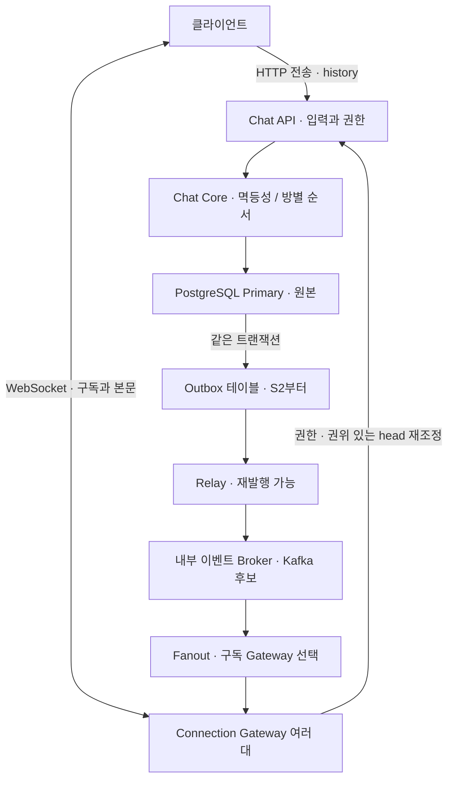

목표 책임 구조이며 설치 상태가 아닙니다. Outbox는 메시지와 같은 DB의 테이블입니다. Connection Gateway는
소켓·구독·송신 큐를 소유하는 앱 역할이며 Nginx 같은 edge proxy와 다릅니다. S1은 API/Gateway를 한 프로세스에
두어도 책임은 분리합니다. 새 서버가 기존 소켓을 자동 인계하지 않으므로 연결 분산·drain·재접속을 별도로 검증합니다.

| 부하 | 확장·측정 영역 | 남는 병목 |
| --- | --- | --- |
| 동시 연결 | Gateway 수·연결당 RSS·FD·heartbeat | CPU만 낮다고 연결 여유가 있는 것은 아닙니다. |
| 여러 방 쓰기 | API 수·DB 풀·commit율 | API만 늘리면 DB 경합이 악화될 수 있습니다. |
| 한 방 쓰기 | 방별 직렬화·잠금 대기 | 행 잠금·Kafka partition은 hot 방을 자동 병렬화하지 않습니다. |
| 많은 수신자 | fanout·Gateway 송신 큐·전송 byte | 한 이벤트의 비용이 온라인 수신자 수만큼 증폭됩니다. |
| 재접속·history | 동기화 예산·조회율·페이지 크기 | 연결 복구를 DB 조회 폭주로 전파하지 않습니다. |

hot 방은 유입 제한·다른 방과의 격리를 먼저 검증합니다. 전용 방 처리자·샤딩·셀 이동은 측정 후 비교하며
도입 시 epoch/fencing을 실제 쓰기 경계에서 검사합니다. lease 만료만으로 늦은 구 소유자 쓰기를 막았다고 주장하지 않습니다.

## 단계별 결과와 승인 경계

구현 버전은 **V1 = S1 정확성 기준선**, **V2 = S2 분산 전달**로 부릅니다.
S3는 각 버전의 부하·확장 검증 단계이며, S4 제품 기능은 V2 완료에 자동 포함하지 않습니다.
이는 구현 범위의 버전이지 HTTP `/v1`이나 이벤트 `schema_version`의 변경을 뜻하지 않습니다.

| 단계 | 결과와 검증 | 아직 보장하지 않는 것 |
| --- | --- | --- |
| S1 정확성 | 두 합성 사용자 DM, 단일 API/Gateway, Primary 저장·키·seq·본문 전달·history/head 복구 | 다중 서버 전달·대규모 fanout·운영 인증입니다. |
| S2 분산 전달 | API/Gateway 각각 2개 이상, outbox·broker·fanout, 재발행·노드 종료·재구독 | 실제 그룹 권한·샤딩·지역 장애 무손실입니다. |
| S3 부하·확장 | 연결·쓰기·수신자 독립 부하, 증설 비교, hot 방·느린 수신자·배포 복합 장애 | 로컬 수치를 13억 사용자 보장으로 일반화하지 않습니다. |
| S4 제품 확장 | 그룹·멤버 변경·외부 동기화·수정/삭제/보관 계약을 별도 확정 | 합성 부하 fixture를 실제 그룹·외부 연계 기능으로 표현하지 않습니다. |

S1의 commit 후 메모리 전달은 history로 복구하는 기준선입니다. S2에서 메시지와 발행 의도를 원자화합니다.
S1 처리량을 outbox·broker 비용을 포함한 S2 처리량으로 제시하지 않습니다. 단계마다 별도 구현 계획·예산·승인을 거칩니다.

## V1 · V2 구현 설계

Status: design-draft · 2026-09-07 사용자 요청으로 버전별 설계를 구분했습니다.
V2의 Kafka는 우선 설계 대상으로 두며 설치·운영 예산·세부 설정은 구현 착수 전에 확정합니다.
버전마다 별도 설계 문서를 복제하지 않고 이 절이 범위와 전환 조건만 소유합니다.

| 영역 | V1 · 단일 서비스 | V2 · Kafka 기반 분산 전달 |
| --- | --- | --- |
| 목적 | 메시지 저장·중복 방지·순서·유실 복구를 검증합니다. | 여러 API/Gateway에서 같은 계약을 유지하고 전달 장애를 복구합니다. |
| 실행 단위 | API와 WebSocket Gateway를 한 프로세스에 두며 역할은 구분합니다. | API·Gateway를 독립 배포하고 각각 2개 이상으로 검증합니다. Relay·Fanout도 별도 실행합니다. |
| 저장 | Primary에 counter와 메시지를 원자적으로 저장합니다. | 같은 transaction에 Outbox 이벤트를 추가합니다. API가 Kafka에 직접 이중 쓰기하지 않습니다. |
| 실시간 전달 | commit 후 프로세스 내부에서 Gateway로 전달을 시도합니다. | Outbox Relay → Kafka → Fanout → 구독 Gateway들의 큐 → 소켓으로 전달합니다. |
| 구독 위치 | 해당 프로세스의 로컬 구독 목록을 사용합니다. | 방별 Gateway 위치와 Gateway instance identity·TTL을 관리합니다. 저장 기술은 후속 선택입니다. |
| 실패 복구 | commit 후 전달 유실은 Primary head 비교와 history로 복구합니다. | 발행 전 장애는 Outbox 재시도, 중복·역순·전달 유실은 소비자 처리와 기존 history 계약으로 복구합니다. |
| 검증 범위 | 기존 N/F/C 테스트와 단일 프로세스 종료·복구입니다. | V1 회귀 검증에 D1–D5·D8 등 분산 장애와 다중 Gateway 전달 검증을 추가합니다. |
| 제외 | Kafka·외부 플랫폼·실제 그룹 권한·다중 서버 전달입니다. | DB 샤딩·지역 장애 무손실·실제 외부 동기화·무제한 hot 방 처리입니다. |

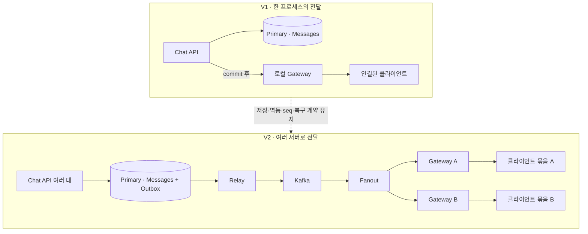

### V1에서 준비할 확장 경계

- 메시지 저장·멱등 처리를 소켓 연결 관리와 분리합니다. commit 전 실시간 이벤트를 보내지 않습니다.
- 이벤트 identity·payload와 클라이언트 복구 계약은 [분산 전달·복구 계약](#분산-전달복구-계약)과
  [동작 흐름](#동작-흐름)을 따릅니다. V2를 위해 V1에 미사용 Kafka 코드나 빈 구현체를 만들지 않습니다.
- 실제 저장·history·재시도 경로가 동작하면 [UUID 비교](#구현-후-필수-후속-검증--uuid-v4v7-인덱스-비교)를 실행합니다.

### V2 착수 전에 확정할 내부 계약

- **발행:** Outbox claim/lease·fencing·batch·재시도·격리 정책을 정합니다. Kafka 수락 전 발행 완료로
  표시하지 않습니다. 방 ID를 partition key로 두는 것만으로 DB seq 순서가 보장되지는 않으므로,
  [분산 전달 계약](#분산-전달복구-계약)의 발행 소유권·역순 복구를 검증합니다.
- **분배:** Fanout 소비자 그룹은 이벤트를 분담하고 해당 방의 모든 구독 Gateway로 전파합니다.
  Gateway별 소비자 그룹을 무조건 늘리거나 한 그룹이 자동 broadcast한다고 가정하지 않습니다.
- **구독:** 인증·방 권한을 검증한 뒤 구독 경로를 등록합니다. 재시작·TTL 만료·구독 중 이벤트 경쟁과
  stale Gateway를 다루고, 경로 준비 후 subscribed/head를 보냅니다. 레지스트리는 메시지 원본이 아닙니다.
- **완료:** offset 처리 기준은 bounded Gateway 큐 수락 또는 명시적 resync 처리입니다.
  프로세스 종료로 큐를 잃어도 단말 수신 완료로 간주하지 않고 재접속·history로 복구합니다.
- **적체:** Outbox 나이·Kafka lag·Gateway 큐 크기와 DB 연결 총량을 관측합니다. backlog/디스크 예산을
  넘으면 신규 쓰기를 commit 전에 제한하며, 이미 stored로 응답한 메시지는 오류처럼 버리지 않습니다.
- **설정:** partition 수·보존 기간·복제 수·acks·ISR·producer idempotence는 실행 환경별로 정합니다.
  단일 로컬 broker를 운영 HA나 end-to-end exactly-once의 증거로 사용하지 않습니다.

### V1에서 V2로 전환하는 순서

1. V1 정확성 검증과 계측을 확보한 뒤 V2 환경·자원·완료 조건을 승인합니다.
2. Outbox 스키마와 이를 쓰는 호환 API를 먼저 배포합니다. 전환 중 구버전 writer가 남으면
   Outbox 없는 메시지가 생길 수 있으므로 writer 교체 완료를 확인하고 전환 경계를 기록합니다.
3. Relay·Kafka·Fanout·Gateway 구독 경로를 준비합니다. 기존 프로세스 내부 전달과 겹치는 동안은
   같은 event ID로 중복 제거하며, 전환 이전 기록은 전체 Kafka 재발행 대신 history로 복구합니다.
4. 신규 연결을 준비된 Gateway로 유도하고 기존 연결을 drain합니다. 클라이언트는 재구독·history를 수행합니다.
5. 다중 Gateway 전달·재발행·broker 중단·구신버전 혼재를 검증한 뒤 내부 직접 전달 경로를 제거합니다.
   실패 시 호환 가능한 이전 버전으로만 되돌리고 Outbox 기록은 보존합니다. V2 생성 기록을 유지하지
   못하는 구버전으로의 rollback을 안전하다고 가정하지 않습니다.

## ERD와 저장의 실현

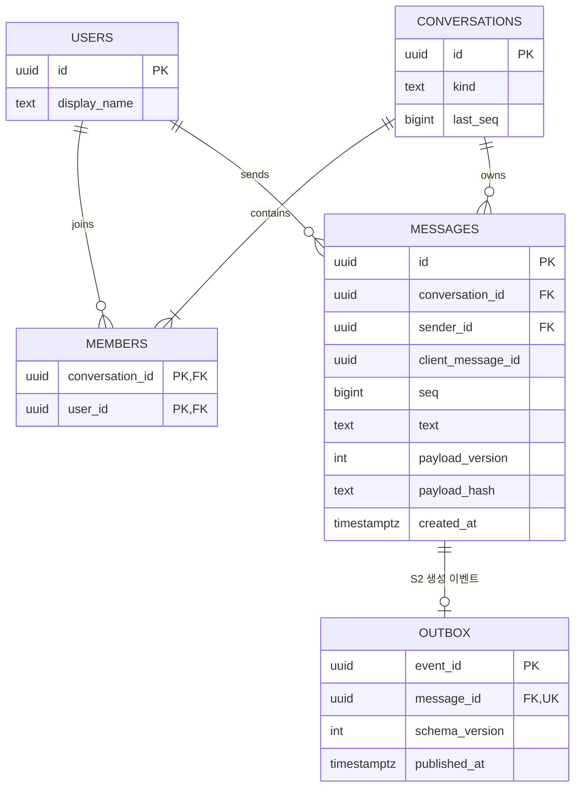

- S1의 멱등성 결과는 별도 테이블 없이 메시지 행에 보관합니다. `UNIQUE(conversation_id, sender_id, client_message_id)`와 `UNIQUE(conversation_id, seq)`를 둡니다. 같은 본문의 다른 키는 별도 메시지입니다.
- `seq > 0`, `last_seq >= 0`, 참여자 복합 PK를 검증합니다. history는 방별 seq 인덱스를 사용합니다. S1은 고정 멤버 DM이며 멤버 변경 API가 없습니다.
- fingerprint는 보조입니다. 동일 키의 payload version·검증된 원문도 비교하여 hash만으로 다른 원문을 같다고 처리하지 않습니다.
- S1에서 메시지·멱등 키를 만료·삭제하지 않습니다. 삭제·보관 정책을 추가할 때 키 보존과 cursor 연속성도 함께 재설계합니다.
- S2에서는 신규 메시지·counter·생성 outbox를 같은 트랜잭션에 저장합니다. stable event ID를 유지하고 replay는 새 seq·outbox를 만들지 않습니다. relay claim/lease·재시도·격리 필드는 S2 계획에서 확정합니다.
- 내구성은 실제 DB의 지속성 설정·스토리지 조건을 확인한 범위에서만 주장합니다. durability를 낮춘 처리량은 인정하지 않으며 단일 Primary는 디스크·호스트 소실이나 지역 장애 무손실을 보장하지 않습니다.

## 분산 전달·복구 계약

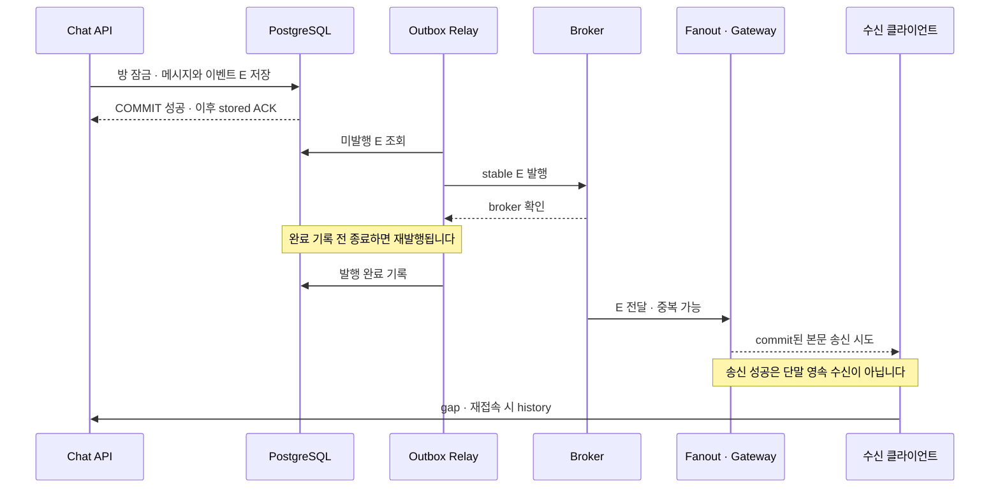

- broker 확인 전 outbox 완료를 기록하지 않습니다. bounded 재시도·격리·경보·재처리 경로를 두며 broker 확인을 수신·읽음으로 취급하지 않습니다.
- Kafka 후보 key는 conversation ID입니다. 여러 relay·소비자 병렬 처리로 DB 순번과 도착 순서가 달라질 수 있습니다. S2에서 partition별 단일 발행 소유권과 방별 seq 검증·복구를 시험합니다.
- Kafka 소비자 그룹은 이벤트를 분담합니다. fanout 담당자가 구독 Gateway 목록으로 전파하고 Gateway가 로컬 소켓으로 확장합니다. 같은 그룹의 Gateway 전부가 모든 이벤트를 받는다고 가정하지 않습니다.
- 구독 등록·해제·TTL·재시작 재등록은 S2의 필수 계약입니다. 경로 준비 전에 subscribed를 보내지 않고 오래된 라우팅 때문에 놓친 이벤트는 history로 복구합니다.
- fanout 처리는 bounded Gateway 큐 수락 또는 명시적 resync 처리를 기준으로 완료합니다. 단말 수신 확인이 아니며 느린 Gateway 때문에 전체 partition이 무한 대기하지 않습니다.
- 후속 DB 변경 소비자는 `(consumer_name, event_id)` 원장과 변경을 함께 commit한 뒤 offset을 처리합니다. 소켓 송신·외부 provider 실행까지 exactly-once라고 부르지 않습니다.
- 외부 동기화는 별도 adapter·권한·provider mapping·멱등 키를 갖습니다. 내부 대화 발송과 분리하며 provider 응답 유실은 조회·대사 계약이 필요합니다.

### WebSocket 프레임 후보

| 프레임 | 계약 |
| --- | --- |
| `subscribe {conversation_id}` | 세션·Origin·방 참여 권한을 검증합니다. 브라우저 탭/세션당 연결 하나를 기본으로 여러 방을 구독할 수 있습니다. |
| `subscribed {conversation_id, head_seq, protocol_version}` | 라우팅 준비 후 Primary에서 head를 조회해 반환합니다. 이후 이벤트 buffer와 history를 합칩니다. |
| `message.created {event_id, schema_version, message}` | message ID·방·sender·client key·seq·원문·생성 시각을 전달합니다. `(conversation_id, seq)`의 다른 원문은 오류입니다. |
| `heads {items}` | 활성 방의 권위 있는 head 묶음이며 마지막 이벤트 유실을 감지합니다. 읽음 receipt가 아닙니다. |
| `resync_required {conversation_id, reason}` | 버퍼 초과·라우팅 전환 때 사용합니다. 송신할 수 없으면 연결을 종료하고 재접속 복구를 유도합니다. |

S1 생성 이벤트의 ID는 메시지 ID에 대응하는 stable 값으로 정하고 S2에서도 같은 identity를 유지합니다.
이벤트 schema version과 payload fingerprint version은 별개입니다. seq/cursor의 JSON 표현은 Python·TypeScript의
정수 범위 차이를 피하도록 구현 계획에서 고정하고 안전 정수 경계 시험을 포함합니다. 합의 전 무검증 number 변환을 사용하지 않습니다.

## 과부하·런타임·배포 계약

DB 풀 획득·잠금·statement·전체 요청 timeout, actor/방별 유입, 연결/구독 수, 소켓 큐의 메시지 수·byte 상한을
구현 계획에서 명시합니다. 수치 미정인 상태로 과부하 시험을 실행하지 않습니다. rollback 확인 전 연결을 재사용하지 않습니다.
수용 전 유입 제한은 429, 의존성 불능은 503 후보이며 commit 불명은 새 키로 재실행하지 않습니다.
재접속·재시도는 backoff·jitter·예산을 두고 history 동기화도 제한합니다.

Python은 async I/O와 blocking SDK를 구분하고 event loop lag·CPU·RSS·직렬화 비용을 측정합니다.
단일 방 직렬화와 fanout CPU 병목을 GIL이라는 용어만으로 설명하지 않습니다. API의 FastAPI 선택이
Gateway 언어의 영구 고정을 뜻하지 않으며, 언어 변경은 동일 계약·부하에서 실측 후 판단합니다.
Gateway는 연결·송신 큐·메모리, API는 처리량·대기·CPU, relay는 outbox 최고 나이·lag를 함께 보고 DB 총 연결 예산을 제한합니다.

배포는 새 버전 readiness → 신규 연결 유입 전환 → 구버전 drain → 제한 시간 내 재접속·history 복구 → 종료 순서로 검증합니다.
기존 TCP/WebSocket은 끊길 수 있습니다. 무중단 기준은 저장·복구·가용성 목표이며 영구 연결 유지가 아닙니다.
구·신버전의 키·seq·이벤트 스키마를 호환하고 DB migration은 확장 → 호환 배포 → 정리 순서로 계획합니다.
알 수 없는 필수 이벤트 버전은 조용히 버리고 cursor를 전진하지 않으며 관측 가능한 오류·업데이트 안내·재동기화로 처리합니다.

## 대용량 증빙 계획

연결 수 C, 신규 메시지율 W, 방 수 R, 온라인 수신자 수 F, 본문 byte B, 재접속률을 독립 축으로 둡니다.
전파량은 대략 `W × F`, 본문 전송량은 `W × F × B`이며 protocol·TLS·재시도·history 비용은 추가입니다.

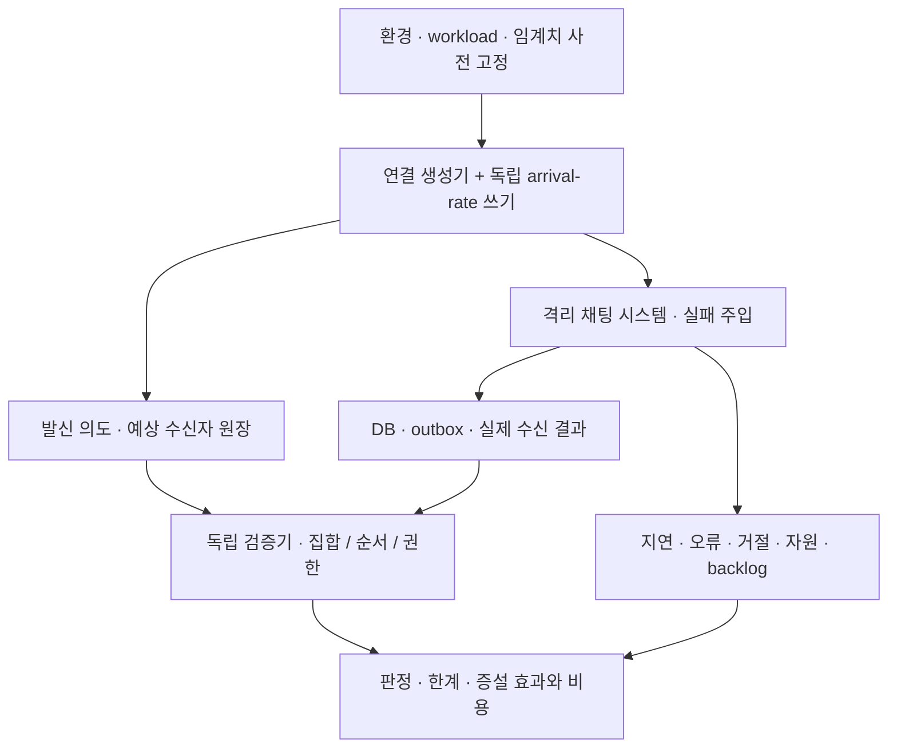

| 시험 | 초기 실험 후보 | 증명할 항목 |
| --- | --- | --- |
| 연결 | 100 → 1,000 → 5,000, 쓰기율 고정 | 연결당 자원·heartbeat 비용입니다. |
| 쓰기 | 10 → 100 → 500 msg/s, 방·수신자 고정 | 지속 가능한 commit율·잠금·풀 대기입니다. |
| fanout | 방당 수신자 2 → 100 → 1,000, 쓰기율 고정 | 수신 지연·송신량·느린 수신자 격리입니다. |
| 편중 | 쓰기의 80%가 한 방에 집중 | hot 방 한계와 다른 방의 서비스 품질입니다. |
| spike·soak | 기준 부하 3배 30초, 안정 부하 60분 | 거절·회복·메모리와 backlog 누적입니다. |
| 증설 | 같은 workload의 1대/2대, 이후 각각 한계 탐색 | 비용·용량·병목 이동이며 무조건 2배를 기대하지 않습니다. |

숫자는 PC 적정량이나 실행 승인값이 아닙니다. 실행 전 현재 CPU·메모리·포트·DB·생성기 한도를 확인하고
상한을 낮추거나 별도 장비를 정합니다. 대규모 수신 fixture는 운영 그룹 권한 기능과 분리합니다.
k6는 HTTP arrival-rate·WebSocket 부하 후보이며 버전·프로토콜 적합성은 구현 전 고정합니다. 쓰기는 응답이 느려져도
목표 유입률을 유지하는 open model로 비교하고 실제 전송률·발생하지 못한 작업도 보고합니다.
연결·수신 대조는 별도 시나리오로 구성하며 S3는 생성기와 서버 분리를 우선합니다. 같은 PC는 자원 경쟁·loopback 한계를 기록합니다.

### 통과·중단 기준 후보

- 정확성: 시험 범위의 중복 저장·다른 원문·권한 위반·복구 후 영구 gap은 0건입니다. negative control로 검사기 자체도 검증합니다.
- 안정 구간: 저장 ACK p99 ≤ 500ms, 정상 온라인 수신 반영 p99 ≤ 1s, 예상하지 않은 오류 ≤ 0.1%를 초기 목표로 제안합니다. 미실측이며 실행 전 승인합니다.
- warm-up 2분·측정 10분·회복 구간을 분리해 같은 조건 3회 반복하는 후보입니다. backlog가 계속 증가하는 처리량은 안정 용량이 아닙니다.
- 장애 복구 목표 후보는 의존성 회복 후 backlog·수신 복구 30초입니다. 초과하면 실패·재검토로 보고하며 장애 지속 중 상한을 주장하지 않습니다.
- 중단 후보는 호스트 가용 메모리 20% 미만 30초, 공유 서비스 영향, 큐/DB 연결 예산 초과, 정확성 위반입니다. 환경별 절대 상한도 사전에 정합니다.
- 생성기 포화·시계 오차·필수 지표 누락은 판정 불가입니다. 실패·거절·미수신을 빼고 성공 요청의 p99만 제시하지 않습니다.

발신 원장은 `(run_id, sender, conversation, key, payload_digest)`와 요청 결과를 기록합니다. ACK된 키 집합은
DB의 동일 원문 키 집합에 포함되어야 합니다. timeout도 commit될 수 있으므로 ACK 수와 DB 행 수가 같아야 한다고 판정하지 않습니다.
시험 종료 후 입력을 멈추고 불명 요청을 같은 키로 해소한 뒤 snapshot H를 고정합니다. 고정 멤버·구독 fixture의
예상 `(message_id, recipient_session)` 집합과 실제 최종 수신 집합을 비교합니다. 원시 중복 전송과 최종 중복 반영은 구분합니다.
대규모 원장은 필요하면 디스크 기반 검증으로 분리하며 표본 검사만 했다면 전체 정합성 증명으로 보고하지 않습니다.
단일 생성기의 monotonic clock 또는 동기화 오차를 포함한 분산 시각으로 지연을 측정하고 서버 로그만으로 단말 지연을 단정하지 않습니다.

### 복합 장애 매트릭스

| ID | 주입 | 통과 증거 | 단계 |
| --- | --- | --- | --- |
| D1 | commit 직후 API 종료 | 같은 키 결과 복구·원본과 S2 outbox 보존 | S1·S2 |
| D2 | 발행 성공 후 relay 완료 기록 전 종료 | 재발행 허용, 원본·후속 DB 효과 중복 없음 | S2 |
| D3 | broker 단절과 계속되는 쓰기 | outbox 누적 관측·예산 제한·복구 후 배출과 대사 | S2 |
| D4 | Gateway 종료·fanout 교체·역순 replay | 재구독·history 복구, 여러 Gateway 수신자 누락 없음 | S2 |
| D5 | poison event·필수 스키마 불일치 | 격리·경보·재처리, 완료로 숨기지 않음 | S2 |
| D6 | 풀 고갈·잠금 지연·commit 응답 유실 | bounded 대기·결과 불명 복구·같은 키 유지 | S1·S3 |
| D7 | hot 방 + 느린 수신자 + 3배 spike | 큐 상한·다른 방 목표·중단 기준 검사 | S3 |
| D8 | 구·신버전 혼재 배포 + 대규모 재접속 | 스키마·키 호환·복구 예산·원본 보존 | S3 |
| D9 | 생성기 포화·지표 삭제·정합성 보호 우회 대조군 | 실패·판정 불가를 실제 탐지 | 전 단계 |
| D10 | 탈퇴·전송·전달 경합, 구 shard 소유자의 늦은 쓰기 | 권한 시점·쓰기 fencing 원자성 | S4·해당 기능 도입 시 |

S1 정상·경합·유실은 아래 N/F/C 케이스를 유지합니다. 계측에는 offered/accepted/committed/replayed/conflicted/unknown/rejected,
실제 수신·복구 지연, 연결·재접속·큐 byte·resync, DB 풀·잠금, S2 outbox 최고 나이·broker lag·fanout 실패,
history·head 재조정 비용, CPU·RSS·event loop lag를 포함합니다. 없는 구성의 지표를 꾸미지 않습니다.
본문·사용자·방·메시지 ID는 metric label이 아니라 별도 합성 시험 원장에서 대조합니다.
보고에는 코드·설정 revision, DB durability·pool·노드 수, 부하 분포, 생성기 한계, 원시 결과·검증 집합,
실패·미검증 범위, 증설 전후 용량과 월 비용 가정을 함께 남깁니다. 로컬 결과로 지역 장애·13억 사용자 수용을 주장하지 않습니다.

### 참고 근거

확인일: 2026-09-07. 아래 자료를 참고한 자체 설계이며 도구·운영 사례가 우리 성능을 보장하지 않습니다.

- [Slack Real-time Messaging](https://slack.engineering/real-time-messaging/): 연결 Gateway와 방별 처리, 구독 Gateway로 fanout하는 책임 분리를 참고합니다.
- [Kafka 4.1 Design](https://kafka.apache.org/41/design/design/): partition·소비·전달 범위를 참고하며 DB·단말까지 exactly-once로 확대하지 않습니다.
- [k6 Open and closed models](https://grafana.com/docs/k6/latest/using-k6/scenarios/concepts/open-vs-closed/): 응답 지연 때문에 유입도 함께 줄어드는 시험 왜곡을 피하도록 설계합니다.

## S1 내부 DM 상세 계약

이하 내용은 S1 범위입니다. S2~S4 구성은 앞부분의 단계별 검토를 거치며 S1에 몰아서 구현하지 않습니다.

[Phase 0 작업 지도](../.ideas/linky-chat/work-map.md) ·
[정합성 후보](../.ideas/linky-chat/reliability.md) ·
[배포 후보](../.ideas/linky-chat/deployment.md) ·
[개발 기준 안내](../docs/README.md#작업별-읽기) ·
[문서 생명주기](../docs/README.md)

## 1차 애플리케이션 컨펌 요약

첫 결과물은 두 합성 사용자가 서로 다른 브라우저에서 텍스트 DM을 주고받는 로컬 앱입니다.
현재 요청은 1차 앱 구체화로 반영하며 상세 명세·구현 계획·DB 실행 승인으로 자동 간주하지 않습니다.

| 영역 | 이번 결과물 |
| --- | --- |
| 화면 | 합성 사용자 선택, DM 본문 목록, 입력·전송, pending/결과 확인 중/stored/오류 상태입니다. |
| API | HTTP 메시지 저장·history 조회, WebSocket 구독·본문 이벤트·head 재조정입니다. |
| 데이터 | 사용자·대화방·참여자·메시지 네 테이블 후보를 사용하며 멱등성·방별 seq를 검증합니다. |
| 복구 | 새로고침·재접속·ACK/알림 유실에서 같은 원본을 조회하고 중복을 방지합니다. |
| 계측 | 아래 기본 Metrics를 앱에서 수집·조회 가능하게 구현하고 정상·실패 입력으로 검증합니다. |
| 실행 | Next.js Node + FastAPI 단일 프로세스의 loopback 실행을 후보로 둡니다. PostgreSQL은 기존 인스턴스의 승인된 논리 DB만 사용합니다. |

화면은 읽음·상대방 전달 완료를 stored와 혼동하지 않습니다. 이 앱은 제품의 첫 흐름이며
운영 인증·전체 채팅 기능·대용량 운영 보장을 완성한 결과물이 아닙니다.
외부 연동, 수정·삭제 이력, 그룹·첨부·검색, Prometheus/Grafana 설치, K8s 배포·HPA·대용량 부하는 후속입니다.
자원 관측과 확장 후보는 [작업 지도](../.ideas/linky-chat/work-map.md)를 참고하되 해당 전체 범위를 이번 앱에 끌어오지 않습니다.

## Objective (목표)

Laughtale의 첫 제품 vertical slice로 합성 사용자 두 명이 서로 내부 DM 텍스트를 보내고,
저장 결과와 재접속 복구를 두 브라우저에서 확인할 수 있는 계약을 정합니다. 이번 Phase 1은
`internal-chat`이 필요로 하는 `chat-core`의 권한·저장·멱등성·대화 내 순서·cursor 경계만
명세하며, 애플리케이션 구현이나 인프라 변경을 시작하지 않습니다.

## 예상 결과

- 내부 DM의 사용자 흐름, 소유권, 데이터·HTTP·실시간 전달 경계가 검토 가능한 상태로 존재합니다.
- commit 이후 ACK, 동일 요청 key의 재시도와 충돌, ACK 유실, 재접속 cursor 복구의 판정 기준이 존재합니다.
- 동시 쓰기와 pagination 중에도 메시지가 중복되거나 영구 누락되지 않는 순서 계약이 존재합니다.
- 내부 메시지가 외부 플랫폼 발송 경로에 들어가지 않는 금지 경계와 검증 기준이 존재합니다.
- 구현 전에 승인이 필요한 핵심 결정이 세 개 이하로 분리되어 있습니다.

## 현재 상태와 가정

Source-backed: 저장소는 초기 구상 단계이며 실행 가능한 애플리케이션이 아직 없습니다.
[`k3s-bootstrap.md`](k3s-bootstrap.md)는 frontend를 Next.js App Router의 Node server mode로
실행하고 설치된 pnpm을 package manager로 사용하는 선택을 이미 확정했습니다. 이 선택과
Next.js app·package가 아직 생성·설치되지 않은 현재 상태를 구분합니다. FastAPI, PostgreSQL,
Python·DB toolchain은 아래의 승인 전 후보입니다.

Assumption: 대표 사용자 흐름은 `user_a`와 `user_b`라는 비식별 합성 사용자, 두 사용자가
멤버인 DM 한 개, 서로 저장소가 격리된 브라우저 context 두 개로 검증합니다. 실제 사용자,
기존 Linky 코드, 의료 데이터, 인증 정보는 사용하지 않습니다.

Assumption: 첫 slice는 단일 chat backend process와 하나의 권위 있는 PostgreSQL write
database를 사용합니다. 별도 backend 서비스, replica, Redis, Kafka, 검색 engine, Kubernetes
workload를 선행 조건으로 두지 않습니다.

## 범위

### 포함합니다

- 합성 사용자 두 명의 1:1 텍스트 DM 생성 fixture와 메시지 송수신 화면을 포함합니다.
- 현재 DM 멤버의 전송·조회 권한과 비회원·다른 주체 사칭의 거부를 포함합니다.
- HTTP 쓰기, commit 이후 저장 ACK, commit 이후 best-effort 실시간 알림을 포함합니다.
- 동일 `client_message_id`의 재시도, 다른 payload 충돌, ACK 유실 후 결과 복구를 포함합니다.
- 대화별 `seq`, 오름차순 pagination, snapshot 경계, 재접속 cursor 복구를 포함합니다.
- 작은 동시 실행과 실패 주입으로 정상·실패·경합 결과를 판정하는 검증을 포함합니다.
- 기본 HTTP·저장 결과·WebSocket·history 복구 지표의 정의, 내부 수집 endpoint, 계측 검증을 포함합니다.

### 포함하지 않습니다

- 외부 플랫폼 연결·수신·발신, 내부 대화의 외부 공유·중계, provider account를 포함하지 않습니다.
- 그룹 대화, 멤버 추가·탈퇴, 읽음 receipt, typing, presence, 수정·삭제, 첨부, 검색을 포함하지 않습니다.
- 전체 회원가입, SSO, 운영 인증, 실제 사용자 관리, 운영 배포를 포함하지 않습니다.
- Kafka, Redis, Elasticsearch, replica, shard, K8s 추가 설치나 설정을 포함하지 않습니다.
- DB 생성·migration 실행, 공유 PostgreSQL 변경, 외부 부하 발생을 포함하지 않습니다.
- 13억 사용자 규모의 처리량·정확성·가용성을 달성하거나 입증했다고 주장하지 않습니다.

## 동작 흐름

아래는 설계 후보의 동작이며 구현·성능 검증 결과가 아닙니다. 서버 배치는 [아이콘 구성도](linky-chat-overview.html)를
참고합니다. 순서 그림에서는 HTTP/WSS를 전달하는 Traefik을 생략합니다. S1의 API와 Gateway는
한 프로세스 안의 역할이며 S2부터 분리·복제합니다. PostgreSQL Primary가 저장 결과의 원본입니다.

### 1. 메시지 하나를 보낼 때 — S1

수신자는 먼저 방을 구독합니다. 전송 버튼을 누른 순서가 아니라 DB에 확정된 방별 `seq`가 대화 순서입니다.

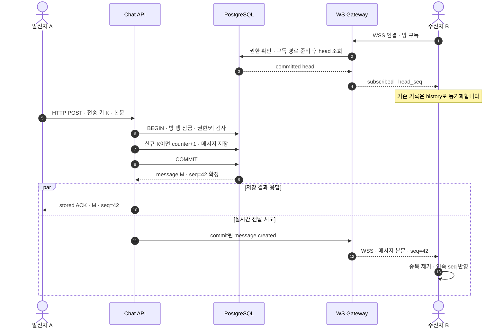

`stored`는 DB 저장 완료이지 상대방 수신·읽음이 아닙니다. ACK와 실시간 수신 사이의 도착 순서는 보장하지 않습니다.
S1은 commit 직후 프로세스가 종료되면 실시간 전달을 놓칠 수 있으며, 아래 복구 경로가 이를 보완합니다.

### 2. 같은 방으로 동시에 보낼 때

두 요청은 다른 API 인스턴스에서 처리해도 같은 DB의 방 행 잠금으로 순서를 정합니다.
아래는 서로 다른 전송 키이며 A가 잠금을 먼저 획득한 예시입니다. 다른 방의 잠금까지 묶지는 않습니다.

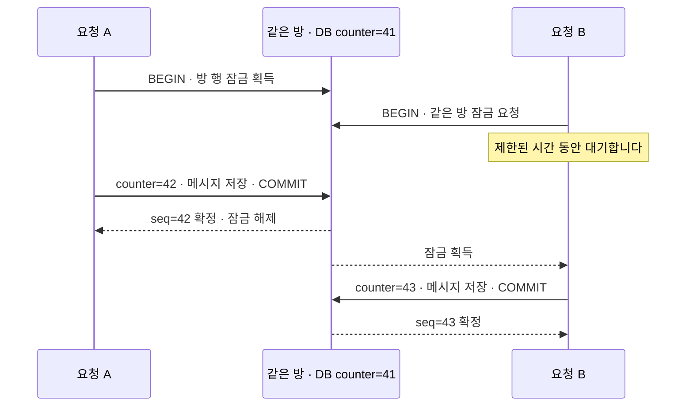

A가 rollback하면 counter 변경도 취소돼 B는 42를 사용합니다. 같은 전송 키·같은 본문 재시도는
새 번호 없이 기존 결과를 반환하고, 같은 키·다른 본문은 `409`로 거부합니다. 한 방의 잠금 경합은
초대형 방의 병목 후보이며 부하 시험에서 별도로 측정합니다.

### 3. 저장 응답 또는 실시간 메시지를 놓쳤을 때

발신자는 같은 키로 저장 결과를 확인하고, 수신자는 마지막으로 연속 반영한 순번부터 복구합니다.

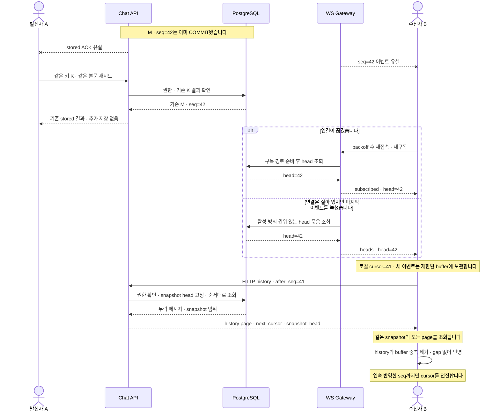

history 중 새 메시지는 buffer와 합칩니다. gap·buffer 초과가 있으면 마지막 연속 cursor부터 다시 동기화합니다.
DB·네트워크가 계속 불통이면 즉시 복구할 수 없습니다. 작성 중 초안의 새로고침 복원은 이 경로와 별개인 FE 책임입니다.

### 4. 서버가 여러 대로 늘어날 때 — S2

S1의 프로세스 내부 전달을 아래 경로로 확장합니다. 메시지와 Outbox는 같은 PostgreSQL 트랜잭션에 저장합니다.

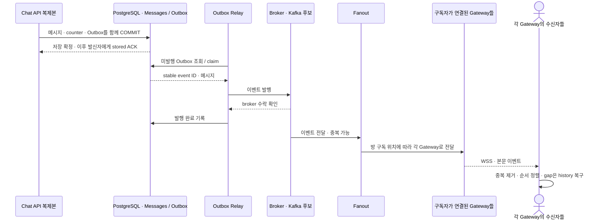

발행 후 완료 기록 전에 relay가 종료되면 재발행할 수 있습니다. 따라서 중복을 허용하고 같은 이벤트의
효과를 중복 생성하지 않습니다. Broker 소비자 그룹 하나만으로 모든 Gateway에 broadcast되지는 않습니다.
저장→발행→수신은 서로 다른 완료 지점이며, 외부 플랫폼 동기화는 별도 adapter 계약으로 후속 추가합니다.

## 기능 소유권

| 경계 | 이번 명세가 정하는 책임 | 이번 명세가 갖지 않는 책임 |
| --- | --- | --- |
| `chat-core` | 메시지 identity, 대화 범위 key, 저장 결과, 대화별 `seq`, idempotency, history cursor를 정합니다. | 외부 provider DTO·SDK·전송 상태를 알지 않습니다. |
| `internal-chat` | DM 멤버 권한, 전송·조회 use case, 내부 대화 UI와 실시간 구독을 정합니다. | 외부 발송 권한이나 account routing을 갖지 않습니다. |
| `chat-workspace` | 이번 slice에서는 내부 DM 화면의 최소 표현만 후보로 둡니다. | 외부 상담 통합 화면과 channel 구분은 후속 범위입니다. |
| `channel-sync` | 이번 slice에 source·dependency·runtime 경로를 만들지 않습니다. | 외부 계정·대화·메시지 동기화는 별도 승인 작업입니다. |

[`k3s-bootstrap.md`](k3s-bootstrap.md)는 K3s·Traefik 실행 경로의 기존 제안입니다.
2026-09-07 확인한 실제 환경은 Lima Kubernetes이며 기존 task의 클러스터 계획과 다릅니다.
이번 앱은 loopback 실행을 후보로 두며 cluster·Gateway·container 설정을 변경하지 않습니다.
`apps/web` 구현 전 두 task의 승인 상태와 파일 소유권을 맞추고 중복 app을 생성하지 않습니다.

## 최소 stack 후보

| 책임 | 최소 후보 | 현재 결정 상태 |
| --- | --- | --- |
| Web 실행 | Next.js App Router + Node server mode | 기존 K3s task의 확정 선택이며 app·package는 아직 설치 전입니다. |
| Web package manager | pnpm | 기존 K3s task의 확정 선택이며 host에는 설치되어 있지만 app manifest·script는 아직 없습니다. |
| Web 언어 | TypeScript | 이번 명세의 승인 전 후보입니다. |
| Chat API | FastAPI + typed Python | 제안이며 설치 전입니다. |
| 저장소 | PostgreSQL + 미정 driver·mapping 도구 | 제안이며 database·schema를 만들지 않았습니다. |
| 실시간 전달 | WebSocket 본문 이벤트 + HTTP history 복구 | 제안이며 원본과 복구 기준은 DB history입니다. |
| 실험 identity | loopback 전용 합성 session | 아래 제약을 포함한 제안입니다. |
| 검증 | Python test runner + 실제 격리 PostgreSQL + browser E2E | 도구와 정확한 명령은 구현 계획 승인 후 확정합니다. |

Next.js App Router의 Node server mode와 pnpm은 재승인 대상이 아닙니다. 정확한 runtime version,
Python package manager, FastAPI, PostgreSQL 사용 여부와 driver·mapping·migration 도구,
test framework는 Phase 2 승인 전에 선택합니다. 후보를 적었다는 이유로 dependency를 설치하지 않습니다.

## 제안 source layout

아래 경로는 구현 후 사용할 예정 경로이며 현재 존재를 주장하지 않습니다. 책임이 실제로
분리될 때만 파일을 만들고, 한 함수로 충분한 책임에 빈 class나 wrapper를 추가하지 않습니다.

```text
apps/web/
  app/internal-chat/[conversationId]/page.tsx
  src/features/internal-chat/
    InternalDmView.tsx
    internalDmClient.ts
services/chat/
  src/
    chat_core/
      domain/message.py
      application/message_store.py
      persistence/postgres_message_store.py
    internal_chat/
      application/send_direct_message.py
      application/list_direct_messages.py
      api/http.py
      api/realtime.py
  tests/
    unit/
    integration/
tests/e2e/
  internal-dm.spec.ts
```

HTTP adapter는 요청 parsing·형식 검증·session context 전달·응답 변환만 담당합니다.
`internal-chat` use case는 권한과 저장 순서를 조정하고, PostgreSQL query·transaction은
`chat-core`의 persistence adapter가 담당합니다. ORM object나 HTTP object를 계층 사이에
전달하지 않습니다.

## 최소 사용자 흐름

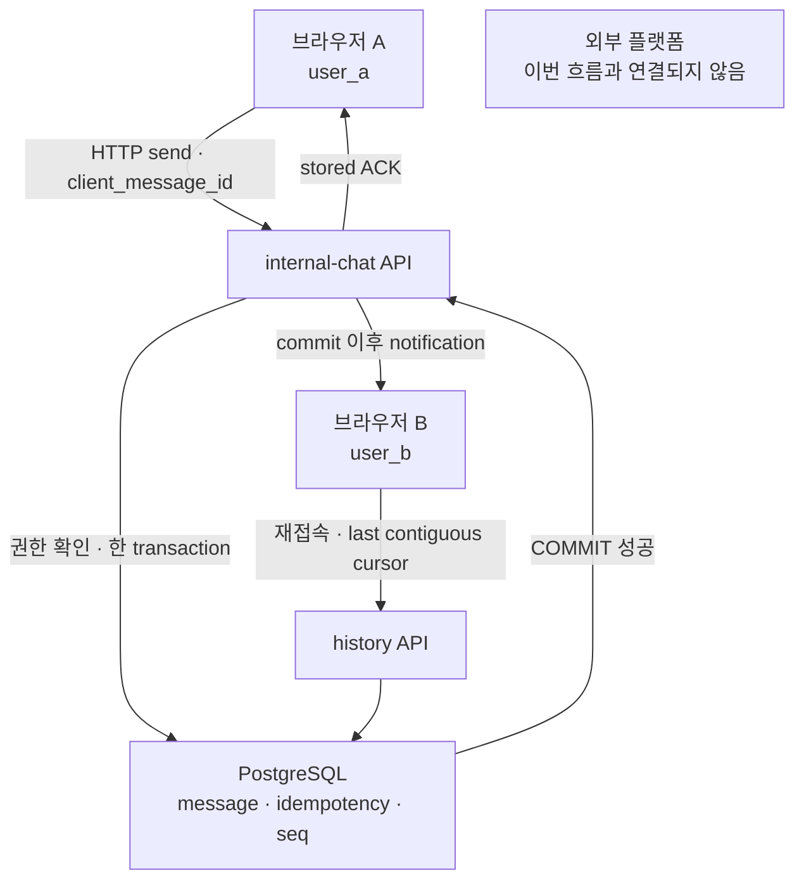

실시간 notification은 commit된 메시지 본문을 빠르게 전달하는 이벤트입니다. 메시지 원본과 복구 기준은
PostgreSQL history이며, notification 수신 자체를 영속 전달이나 읽음으로 해석하지 않습니다.

## Identity와 권한 계약

1. 대표 E2E는 `user_a`, `user_b` 두 합성 사용자와 독립 browser context 두 개를 사용합니다.
2. 실험 session 생성은 loopback interface에서만 노출하고 synthetic identity만 선택할 수 있습니다.
3. 실험 session은 실제 인증이 아닙니다. 같은 machine의 호출자는 다른 synthetic user를 선택해
   사칭할 수 있으므로 인증 강도나 production security를 검증했다는 근거로 사용하지 않습니다.
4. production mode에서는 실험 session route를 mount하지 않으며, 실험 identity 설정이 켜져 있으면
   애플리케이션 시작을 실패시킵니다. 외부 interface에 bind한 상태에서도 사용할 수 없습니다.
5. client request에는 `sender_id`를 받지 않습니다. sender는 server가 확인한 session actor로만 정합니다.
   `sender_id` 같은 미정의 identity field를 보내면 형식 오류로 거부합니다.
6. 전송과 조회는 현재 actor가 해당 DM의 멤버인지 use case에서 확인합니다. 비회원과 존재하지 않는
   conversation은 같은 공개 오류로 응답해 conversation 존재 여부를 노출하지 않습니다.
7. replay 결과를 조회할 때도 actor와 conversation scope를 다시 확인합니다. Idempotency는 권한 우회가 아닙니다.
8. 브라우저 수를 늘리지 않는 비회원 권한 검증은 API·application test의 별도 fixture principal로 수행합니다.

## 메시지 저장과 ACK 계약

### 쓰기 요청 후보

`POST /v1/internal-conversations/{conversation_id}/messages`

```json
{
  "client_message_id": "018f0b8e-0000-7000-8000-000000000001",
  "text": "테스트 메시지"
}
```

- `client_message_id`는 송신 browser가 한 번 정하고 결과를 확인할 때까지 같은 값을 유지합니다.
- `client_message_id`는 유효한 UUID 문자열이어야 하며 잘못된 형식은 `422`로 거부합니다.
- `text`는 server 기준 1자 이상 2,000 Unicode code point 이하를 후보로 둡니다. `text.strip()`이
  빈 값인 공백-only 입력은 `422`로 거부하되, 통과한 원문을 trim하거나 정규화하지 않고 저장합니다.
- Idempotency scope는 `(conversation_id, authenticated_sender_id, client_message_id)`입니다.
- payload fingerprint는 contract version과 검증된 `text`의 정확한 UTF-8 값을 포함합니다.
  공백이나 Unicode를 몰래 정규화해 같은 payload로 취급하지 않습니다.
- 신규 저장은 `201`, 같은 key·같은 payload의 replay는 `200`을 반환하는 후보로 둡니다.
  두 응답은 같은 `message_id`, `conversation_id`, `sender_id`, `client_message_id`, `seq`,
  `text`, `created_at`, `state: stored`를 반환합니다.
- 같은 key에 다른 payload가 오면 `409 idempotency_conflict`로 거부합니다. 기존 message를
  덮어쓰거나 새 message·새 `seq`를 만들지 않습니다.

### 한 대화의 쓰기 transaction

1. transaction을 시작하고 conversation row를 잠급니다.
2. 같은 transaction에서 DM membership과 idempotency key를 확인합니다.
3. 기존 key이면 payload fingerprint와 결과 조회 권한을 확인하고 새 쓰기 없이 기존 결과를 반환합니다.
4. 신규 key이면 transactional conversation counter를 `N`에서 `N+1`로 바꾸고 `seq=N+1`인
   message를 저장합니다.
5. `(conversation_id, seq)`와 idempotency scope에 database unique constraint를 둡니다.
6. counter·message·idempotency 결과를 모두 commit한 뒤에만 `stored` ACK를 만듭니다.
7. 실시간 notification은 commit 이후에 시도하며, 실패 때문에 저장된 message를 rollback하거나
   외부 발송으로 우회하지 않습니다.

DB commit이 실패하거나 rollback되면 저장 ACK를 반환하지 않습니다. HTTP connection이 commit
결과를 받기 전에 끊기면 client는 실패로 단정하거나 새 key를 만들지 않고 같은 key로 재시도합니다.

## 대화 내 순서와 cursor 계약

`seq`는 같은 conversation 안에서 commit되어 읽을 수 있는 저장 순서입니다. 사용자가 버튼을 누른
시각, client timestamp, server 접수 시각, 서로 다른 conversation의 전역 순서를 뜻하지 않습니다.

### `seq` 할당 불변조건

- conversation row의 counter 변경과 message insert를 같은 transaction에서 수행하고 row lock을
  commit 또는 rollback까지 유지합니다.
- 먼저 lock을 잡은 transaction이 끝나기 전에는 다음 writer가 `N+1`을 할당할 수 없습니다.
  rollback된 counter 변경도 함께 취소되므로 첫 slice의 committed `seq`는 1부터 연속입니다.
- PostgreSQL `sequence/nextval`처럼 rollback과 무관하게 번호를 소비하는 값을 cursor의 연속성
  근거로 사용하지 않습니다.
- transaction A가 작은 `seq`를 할당한 채 미commit이고 transaction B가 큰 `seq`를 먼저 commit하는
  구조를 허용하지 않습니다. 이 구조를 바꾸려면 별도의 commit visibility watermark와 gap 복구
  계약을 먼저 승인해야 합니다.
- client는 notification에서 큰 `seq`를 먼저 보더라도 gap을 건너뛰어 cursor를 전진하지 않습니다.
  cursor는 화면에 연속으로 반영한 마지막 `seq`만 나타냅니다.

이 불변조건 때문에 `seq` 할당 순서와 commit 순서가 어긋나 작은 `seq`가 늦게 보이는 동안
client가 큰 `seq`를 cursor로 저장해 작은 message를 영구 누락하는 경로를 차단합니다.

### Pagination 후보

첫 page는
`GET /v1/internal-conversations/{conversation_id}/messages?after_seq={cursor}&limit={limit}`로
요청합니다. 다음 page는 응답받은
`snapshot_head_seq`를 같은 query parameter로 함께 보냅니다.

1. `after_seq`와 `snapshot_head_seq`는 0 이상의 정수이며, `limit`은 생략하면 50, 허용 범위는
   1 이상 100 이하를 후보로 둡니다. 형식이나 범위를 벗어나면 `422`로 거부합니다.
2. 첫 page에서 server는 조회 시점의 committed conversation counter를 `snapshot_head_seq`로 고정합니다.
3. 모든 page에서 `0 <= after_seq <= snapshot_head_seq <= committed_head`를 검증합니다.
4. page query는 `seq > after_seq AND seq <= snapshot_head_seq ORDER BY seq ASC LIMIT limit`입니다.
5. 다음 page는 첫 응답의 같은 `snapshot_head_seq`를 query에 넣고 직전 page의 마지막 `seq`를
   `after_seq`로 사용합니다. 현재 committed head보다 큰 snapshot 값은 거부합니다.
6. `next_cursor`는 마지막으로 반환한 item의 `seq`입니다. 빈 page는 입력 `after_seq`를 그대로
   반환하며 page에 없는 server 최댓값으로 건너뛰지 않습니다.
7. 첫 slice에는 삭제가 없으므로 마지막 page까지 합친 `seq`는 `(initial_cursor, snapshot_head_seq]`
   구간과 정확히 일치해야 합니다. 중복·gap·역순이면 성공으로 처리하지 않습니다.
8. pagination 중 새로 commit한 `seq > snapshot_head_seq`는 현재 snapshot에 섞지 않고 실시간 buffer
   또는 다음 catch-up에서 처리합니다.
9. Client는 `last_contiguous_seq`, pagination snapshot, buffer를 `conversation_id`별로 분리합니다.
   한 conversation의 cursor 최댓값을 다른 conversation에 재사용하지 않습니다.

위 수치는 승인 전 후보입니다. 0건, 정확히 한 page, 한 page를 하나 넘는 경우, 여러 page와
동시 append 경계를 모두 검증합니다.

## ACK 유실과 재접속 복구

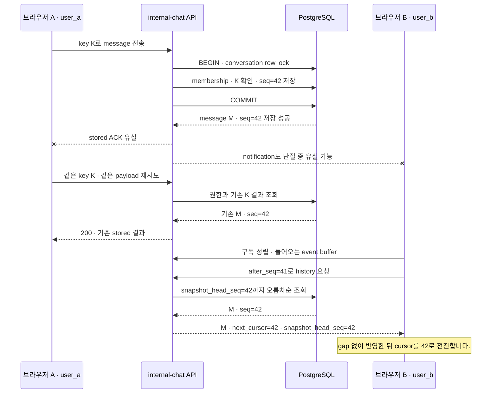

재접속 client는 구독을 먼저 성립시키고 이후 notification을 제한된 buffer에 둔 다음 history를
동기화합니다. History와 buffer를 `(conversation_id, seq)`로 중복 제거하고 snapshot 이후 event를
이어 처리합니다. Buffer 한도를 넘거나 gap이 남으면 cursor를 임의로 올리지 않고 마지막 연속
cursor부터 동기화를 다시 시작합니다. 재접속과 앱 focus 시 server head를 즉시 다시 비교합니다.

기존 ‘클라이언트별 5초 HTTP history 조회’ 후보는 폐기합니다. 대체 후보는 Gateway가 활성 방의
권위 있는 head를 묶어서 주기적으로 재조정하고 `heads` 프레임으로 전달하는 방식입니다.
S1 주기는 10초에 jitter를 주는 실험 후보이며 이전 재조정과 겹치지 않게 합니다. S2에서는 방별
조정 소유권·묶음 조회와 갱신 라우팅을 정해 Gateway마다 같은 방을 DB 조회하는 증폭을 줄입니다.
메시지 이벤트 캐시만 비교하면 마지막 발행 유실을 감지하지 못하므로 Primary 원본의 head와 비교합니다.
head가 마지막 연속 cursor보다 클 때만 history로 누락을 채웁니다. 권위 조회 실패·오래된 head는
정상으로 표시하지 않습니다. 정상 연결·network·DB에서 복구 목표는 `재조정 주기 + head 전달 + history + 반영 지연`입니다.
장애 지속·브라우저 suspend 동안 이 상한을 보장하지 않으며 focus 복귀·재접속 시 즉시 동기화합니다.
작성 중 초안과 로컬 대기 메시지의 보관·새로고침 복원 방식은 FE가 결정하며 이번 BE 설계가 강제하지 않습니다.

## 외부 발송 차단 계약

- Internal DM write use case에는 external sender Port, provider account, channel mapping을 주입하지 않습니다.
- `conversation.kind=internal_direct` message는 외부 발송 대상 query·job·adapter의 입력이 될 수 없습니다.
- 실시간 notification 실패를 외부 API 호출로 보상하지 않습니다.
- 현재 source layout에는 `channel-sync` 구현을 만들지 않습니다.
- 후속 외부 연계가 추가될 때는 내부 conversation fixture가 외부 adapter 호출을 0회로 유지하는
  회귀 test를 반드시 포함하고, 같은 UI에 표시하더라도 send command를 공유하지 않습니다.

## 코드 스타일 실제 규칙의 작은 예

아래는 구현 코드가 아니라 승인 후 적용할 typed contract 예입니다. Python은 `snake_case`,
keyword-only input, 명시적 반환 type, 불변 data를 사용하고 client가 보낸 sender identity를 받지 않습니다.

```python
from dataclasses import dataclass
from uuid import UUID


@dataclass(frozen=True, slots=True)
class StoredMessage:
    message_id: UUID
    conversation_id: UUID
    sender_id: UUID
    client_message_id: UUID
    seq: int


async def send_direct_message(
    *,
    actor_id: UUID,
    conversation_id: UUID,
    client_message_id: UUID,
    text: str,
) -> StoredMessage:
    """인증된 actor를 sender로 사용해 내부 DM을 한 번만 저장합니다."""
    ...
```

- 이름은 `send_direct_message()`처럼 업무를 표현하며 `process()`·`handle()`을 새 업무 이름으로 쓰지 않습니다.
- Domain은 HTTP, ORM, framework object를 알지 않으며 exception은 복구·번역 책임이 있는 경계에서 처리합니다.
- 발생 시각은 timezone-aware UTC로 저장합니다. 대화 순서는 timestamp가 아니라 `seq`로 판정합니다.
- TypeScript는 strict type을 사용하고 API payload를 무검증 type assertion으로 신뢰하지 않습니다.
- 주석·docstring은 이름을 반복하지 않고 identity·순서처럼 숨은 업무 이유를 한국어로 설명합니다.

## Success Criteria

### 정상 경로

| ID | 재현 | 통과 기준 |
| --- | --- | --- |
| N1 | 독립 browser A/B를 각각 `user_a`/`user_b` synthetic session으로 열고 A가 DM을 보냅니다. | A는 commit된 `stored` ACK를 받고 B는 같은 `message_id`·`seq`의 text를 봅니다. DB 원본은 한 행입니다. |
| N2 | B가 답장하고 두 browser를 새로고침합니다. | 두 사용자가 권한 있는 같은 history를 `seq ASC`로 보며 sender와 text가 뒤바뀌지 않습니다. |
| N3 | 0건, 정확히 page 크기, page 크기+1, 여러 page의 history를 조회합니다. | 모든 item이 snapshot 범위에 한 번씩만 나타납니다. `next_cursor`는 마지막 item의 `seq`이고 빈 page에서는 입력 cursor 그대로입니다. |
| N4 | page 1 조회 뒤 새 message를 동시에 append합니다. | 기존 snapshot page에는 섞이지 않고 buffer 또는 다음 catch-up에서 한 번 나타납니다. |
| N5 | 유효 UUID, text 1자·2,000자, limit 생략·1·100 경계와 conversation 두 개의 cursor state를 확인합니다. | 유효 경계값은 계약대로 처리되고 기본 limit는 50입니다. 각 conversation의 cursor·snapshot·buffer는 서로 영향을 주지 않습니다. |

### 실패 경로

| ID | 재현 | 통과 기준 |
| --- | --- | --- |
| F1 | 비회원 fixture가 알려진 DM을 조회·전송하고 browser A가 `sender_id=user_b`를 주입합니다. | 자원 존재와 본문을 노출하지 않고 거부하며 message·counter가 변하지 않습니다. sender 주입은 형식 오류입니다. |
| F2 | message transaction을 commit 전에 실패·rollback시킵니다. | `stored` ACK와 notification이 없고 counter·message·idempotency 결과가 함께 남지 않습니다. 같은 key를 다시 보내면 한 번 저장할 수 있습니다. |
| F3 | commit 뒤 HTTP response를 유실하고 같은 key·같은 payload를 재시도합니다. | 기존 `message_id`와 `seq`를 반환하며 DB message는 한 행이고 새 notification 효과를 중복 생성하지 않습니다. |
| F4 | 같은 key에 다른 text를 보냅니다. | `409 idempotency_conflict`이며 기존 text·seq를 덮어쓰지 않고 새 message를 만들지 않습니다. |
| F5 | recipient notification을 유실한 뒤 `last_contiguous_seq`로 재접속합니다. | 현재 권한과 snapshot 범위의 누락 message를 history로 회복하고 gap을 건너뛰지 않습니다. |
| F6 | local 외의 interface 또는 production mode에서 실험 identity를 켭니다. | route를 사용할 수 없거나 시작이 실패하며 실험 session을 운영 인증으로 사용할 수 없습니다. |
| F7 | 내부 DM을 보낸 뒤 외부 발송 관련 대역의 호출을 확인합니다. | 외부 adapter·provider 호출은 0회이며 내부 message는 외부 queue·outbox에 나타나지 않습니다. |
| F8 | 잘못된 UUID, 공백-only·2,001자 text, limit 0·101, 음수·역전·현재 head 초과 cursor를 보냅니다. | `422`로 거부하며 message·counter·cursor state가 변하지 않습니다. |
| F9 | B의 연결과 focus를 유지한 채 마지막 notification 하나만 버리고 이후 notification을 만들지 않습니다. | 정상 network·DB에서 권위 있는 주기적 heads로 유실을 발견하고 `재조정 주기 + 전달·조회·반영 지연` 안에 복구합니다. 재접속·다음 메시지·클라이언트별 상시 HTTP polling에 의존하지 않습니다. |

### 경합 경로

| ID | 재현 | 통과 기준 |
| --- | --- | --- |
| C1 | 같은 sender가 같은 key·payload를 barrier로 100회 동시에 보냅니다. | 성공 효과는 message 1개와 `seq` 1개이며 모든 성공 응답은 같은 저장 결과를 가리킵니다. |
| C2 | 같은 key에 서로 다른 payload를 동시에 보냅니다. | 하나의 payload만 한 번 commit되고 나머지는 conflict입니다. 어느 payload가 이기는지 사전 보장하지 않습니다. |
| C3 | 같은 DM에 서로 다른 key를 여러 DB connection으로 동시에 보냅니다. | committed `seq`가 고유하고 1씩 증가하며 message가 덮어써지지 않습니다. |
| C4 | transaction A가 conversation row lock을 잡은 채 멈추고 transaction B가 다음 message를 보냅니다. | B는 A의 commit/rollback 전 다음 `seq`를 publish하지 못합니다. A rollback이면 번호를 소비하지 않고, commit이면 B가 그 다음 번호를 받습니다. |
| C5 | notification `seq=44`를 `seq=43`보다 먼저 client에 전달합니다. | client는 44를 buffer하고 cursor 42에서 history를 조회해 43을 채운 뒤 44까지 연속으로 전진합니다. |

## 테스트 전략

| 수준 | 검증 대상 | 필요한 증거 |
| --- | --- | --- |
| Domain/unit | message 값, payload fingerprint, cursor 연속성 규칙 | 외부 I/O 없이 같은 입력·충돌·gap 판정 결과를 확인합니다. |
| Application | session actor 사용, membership, 외부 발송 금지, ACK 생성 시점 | Port 대역으로 허용·거부, DB 변경 요청, external call 0회를 확인합니다. |
| Repository/integration | unique constraint, row lock, counter, commit·rollback, snapshot query | 실제 격리 PostgreSQL의 독립 connection과 barrier로 F2·C1–C4를 재현합니다. |
| HTTP contract | status, request/response field, 공개 오류, pagination | 신규·replay·conflict·권한 오류와 N3–N5, F8을 확인합니다. |
| Browser E2E | 두 synthetic session, 두 browser, 실시간 표시, ACK 유실·재접속·주기 복구 | 격리 browser context 두 개와 network/notification 실패 주입으로 N1–N2, F3, F5, F9를 확인합니다. |
| Negative control | 검사기가 실제 위반을 탐지하는지 확인 | 격리 test double에서 cursor를 큰 `seq`로 먼저 전진시키거나 idempotency 보호를 우회해 판정기가 실패하는지 확인합니다. |

테스트 database는 개발·운영 데이터와 격리하고 실행 전에 target을 확인합니다. 공유 PostgreSQL에
새 instance나 database를 이번 Phase에서 만들지 않습니다. 실제 test database 이름과 생성 방식은
Phase 2에서 별도 승인을 받아 정합니다. Test double 통과를 PostgreSQL 경합 통과로 대체하지 않습니다.

### 구현 후 필수 후속 검증 — UUID v4/v7 인덱스 비교

Status: deferred-until-implementation · 2026-09-07 사용자 합의입니다.

메시지 저장·멱등 재시도 경로를 먼저 구현한 뒤 비교합니다. 현재 UUID 버전을 확정하거나
벤치마크를 실행하지 않습니다. 구현 중 채택하는 버전은 임시 선택임을 기록하고,
성능상 적합하다는 결론은 아래 증거를 확보한 뒤 내립니다.

- [ ] `client_message_id`의 멱등성 인덱스와 `message_id`의 식별자 인덱스를 구분하고,
  한 번에 한 역할의 버전만 바꿔 비교합니다. 대화 순서·history는 기존 `(conversation_id, seq)`를 유지합니다.
- [ ] 실제 테이블·복합 unique 인덱스·UUID 저장 타입을 사용합니다. 같은 DB 버전·자원·초기 데이터량·
  동시성·본문 크기에서 여러 방 분산/한 방 집중, 신규 전송/재시도를 비교합니다.
- [ ] 데이터 증가와 캐시 상태를 통제하고 반복 측정합니다. 처리량, 요청·DB p95/p99 지연,
  인덱스 크기, 버퍼 읽기와 WAL 발생량을 기록합니다. 방 잠금·DB 풀 대기를 따로 관측해
  UUID 비용과 다른 병목을 구분합니다.
- [ ] 같은 키·같은 본문, 같은 키·다른 본문, 동시 재시도를 의도적으로 주입해 정확성 계약도 확인합니다.
  v7 후보는 클라이언트 시계 오차·지연 전송을 포함하며 UUID 순서를 대화 순서로 사용하지 않습니다.
- [ ] 환경·실행 명령·원시 결과·변동 폭·선택 이유를 이 task에 남깁니다. 실행 전 부하·중단 기준을 정하고,
  공유 서비스에 영향을 주는 고부하 시험은 별도 승인합니다. v4의 충돌 확률을 v7에 그대로 적용하지 않습니다.

이 검증은 첫 정확성 구현의 선행 차단 조건이 아니라 **구현 후 남겨두어야 할 작업**입니다.
ID 버전만 비교한 수치를 채팅 전체의 대용량 처리 능력으로 주장하지 않습니다.

## 실행 명령 상태

### 첫 앱의 Metrics 계약 후보

[공통 Metrics](../external/backend-template/design/observability.md#metrics의-공통-판단-기준)와 [Runtime Review](../external/backend-template/design/runtime-review.md)를 따릅니다.
이 절은 채팅 고유 정의만 소유하며 도구 설치·공용 수집기·운영 설정을 확정하지 않습니다.

| 지표 | 목적·정의 | 검증 |
| --- | --- | --- |
| HTTP 요청 수·지연 | 저장과 history 경로를 template으로 구분합니다. 지연은 API 수신부터 응답 처리까지이며 브라우저 렌더링 시간이 아닙니다. | 알려진 정상·형식 오류·권한 오류 요청의 건수와 분류를 확인합니다. |
| 저장 결과 수 | 신규 commit·기존 결과 재확인·payload 충돌·실패·결과 불명을 구분합니다. DB 원장의 대체물은 아닙니다. | 신규 한 건 후 동일 키와 다른 payload를 재시도해 각 결과가 구분되는지 확인합니다. |
| 활성 WebSocket | 현재 프로세스의 연결 수이며 고유 사용자 수가 아닙니다. | 두 연결을 열고 종료해 gauge가 기준값으로 돌아오는지 확인합니다. |
| history 조회·복구 | 조회 시간·반환 건수를 기록합니다. 일반 조회를 전부 누락 복구로 집계하지 않습니다. 실제 gap 복구 판정은 클라이언트/E2E에서 확인합니다. | 알림 유실 뒤 조회로 원본을 복구하고 API 지표와 E2E 결과를 대조합니다. |
| 런타임·DB 진단 | 초기 프로세스 RSS·이벤트 루프 지연·DB 풀 대기·방 잠금 대기의 수집 가능성을 확인하고 구현 항목/미구현 항목을 구분합니다. | 수집된 값만 제시하며 측정 경로 미구현을 0이나 정상으로 표시하지 않습니다. |

이름·단위·histogram 경계와 구현 라이브러리는 계획 승인 전에 정합니다. 위의 요청·저장·연결·조회 계측은
첫 앱 완료 범위이며 런타임 심화 진단의 미구현 항목은 보고에 남깁니다. `/metrics`는 로컬 내부 수집용이며
외부 공개하지 않습니다. 수집기 설치 없이 endpoint 노출·값의 정확성까지 먼저 검증하고,
Prometheus/Grafana 대시보드와 HPA는 별도 작업으로 진행합니다.

### 앱 명령

현재 package manifest, source, test harness가 없으므로 실행 가능한 앱 명령은 아직 없습니다.
아래 항목은 구현 후 실제 구성에서 제공할 명령이며, 이 문서에서 가짜 command를 확정하지 않습니다.

| 목적 | 상태 |
| --- | --- |
| Web 개발·build·lint·type check | 구현 후 `apps/web`의 실제 package manager script로 제공합니다. |
| API 개발·lint·type check | 구현 후 `services/chat`의 실제 Python toolchain command로 제공합니다. |
| Unit·integration test | 격리 test database 계약과 함께 구현 후 제공합니다. |
| Browser E2E | 두 browser context와 실패 주입 fixture를 구현한 뒤 제공합니다. |

문서 작성 단계의 local link·구조 검사는 아래 검토 기록에 별도로 남깁니다. 문서 검사가
애플리케이션 build, test, browser 동작을 통과했다는 뜻은 아닙니다.

## 변경 경계

### Always

- 인증된 server session actor를 sender로 사용하고 DM membership을 use case에서 검사합니다.
- message·idempotency 결과·conversation counter를 한 transaction으로 commit한 뒤 ACK합니다.
- 동일 key replay와 다른 payload conflict를 DB constraint를 포함해 판정합니다.
- 공개 UUID·text·pagination 입력의 형식과 범위를 server에서 검증합니다.
- cursor를 conversation별 마지막 연속 `seq`로만 전진하고 pagination snapshot 경계를 유지합니다.
- 권위 있는 주기적 heads와 focus·재접속 trigger로 누락을 감지하고 필요한 history만 조회합니다.
- 내부 message를 외부 발송 경로와 source dependency에서 분리합니다.
- 실패·경합 test에서 응답뿐 아니라 DB 원본, counter, 호출 횟수를 함께 확인합니다.
- 합성 데이터만 사용하고 secret·session value·message 본문을 log에 남기지 않습니다.

### Ask

- 아래 세 핵심 미정 사항을 승인받고 나서 Phase 2 계획을 작성합니다.
- dependency 설치, source scaffold, database·schema·migration 생성 또는 변경 전에 확인합니다.
- ACK·idempotency scope·`seq`·cursor 불변조건을 바꾸거나 완화하기 전에 확인합니다.
- 운영 인증, 외부 플랫폼, broker·cache·replica·K8s를 범위에 추가하기 전에 확인합니다.

### Never

- 내부 message를 외부 provider, 외부 queue·outbox, channel routing으로 보내지 않습니다.
- client의 `sender_id`, timestamp, 표시명을 identity나 대화 순서의 근거로 신뢰하지 않습니다.
- DB commit 전에 `stored` ACK를 보내거나 notification 성공을 저장 성공으로 간주하지 않습니다.
- 큰 `seq`를 먼저 보았다는 이유로 gap을 건너뛰어 cursor를 전진하지 않습니다.
- rollback에서 번호를 소비하는 allocator를 연속 cursor 계약에 그대로 사용하지 않습니다.
- 실험 identity를 non-loopback·production에 노출하거나 실제 인증처럼 설명하지 않습니다.
- 실제 Linky code·의료 데이터·credential을 읽거나 복제하지 않습니다.
- 공유 PostgreSQL을 새로 띄우거나 변경하고, 외부 부하·운영 변경·commit·push를 수행하지 않습니다.

## 미정 사항 · 승인 필요

1. **Backend·저장소 stack과 위치:** `apps/web`은 기존 K3s task가 확정한 Next.js App Router
   Node server mode와 pnpm을 그대로 사용하며 재승인하지 않습니다. 새 `services/chat`에 FastAPI +
   PostgreSQL로 시작하는 안과 정확한 Python·DB driver·mapping·migration toolchain만 승인 후
   Phase 2에서 조사·고정합니다.
2. **실험 identity:** 두 browser 검증을 위해 loopback 전용 synthetic session을 추천합니다.
   이는 누구나 synthetic identity를 선택할 수 있는 spoofable harness이며, 실제 인증 검증과
   production 사용을 명시적으로 제외하는 조건으로 승인해야 합니다.
3. **저장·순서·전파·검증 계약:** commit 후 stored ACK, 방별 row-lock counter·연속 seq,
   snapshot pagination·본문 이벤트·권위 head 복구, S2 outbox·broker·fanout과 S3 부하·복합 장애
   계획을 단계별 추천안으로 검토합니다. 수치 후보는 실험 전 환경·예산과 함께 확정하고
   저장·복구 계약을 완화하려면 대체 watermark·gap 복구 증거가 필요합니다.

## 이전 S1 초안의 검토 기록

아래는 이전 S1 초안의 검사 이력입니다. 이번 대용량 확장·head 계약 변경의 검증 결과로 재사용하지 않습니다.

| 검토 항목 | 결과 | 비고 |
| --- | --- | --- |
| 목표와 예상 결과 분리 | 통과 | 작업 objective와 검증 가능한 결과가 별도 section에 존재합니다. |
| 범위와 소유권 | 통과 | `chat-core`의 필요한 경계와 `internal-chat`만 명세하고 나머지는 제외합니다. |
| 정상·실패·경합 기준 | 통과 | N1–N5, F1–F9, C1–C5와 검증 수준의 대응을 대조했습니다. |
| Mermaid fence·구조 | 통과 | 최소 흐름과 ACK 유실·재접속 sequence의 fenced block 2개를 확인했습니다. |
| Mermaid 실제 렌더링 | 통과 | TB 변경 후 `/tmp/linky-chat-preview.zTM14C/verify-dm.cjs`를 다시 실행해 diagram 2개의 문법, 1440px overflow 없음, browser error 없음을 확인하고 두 이미지를 육안 확인했습니다. |
| Local Markdown link | 통과 | 이 문서와 `tasks/README.md`의 상대 link target이 checkout에 존재함을 확인했습니다. |
| Markdown LSP | 미지원 | 현재 `.md` LSP가 구성되지 않아 별도 diagnostic은 실행할 수 없습니다. |
| 앱 build·test·browser 검증 | 미실행 | 애플리케이션이 없고 구현 승인을 받지 않았습니다. |

## 이번 최종 검토안의 문서 검증

- Mermaid 6개를 실제 렌더링하고 PC 1440×1080에서 전체 구조·ERD·증빙 흐름을 확인했습니다. 수평 넘침은 없었습니다.
- 상대 파일 링크와 `git diff --check`를 확인했습니다. 기존 5초 HTTP polling과 FE 초안 복원 강제는 현재 제안에서 제외했습니다.
- 기존 N/F/C 기준은 유지하며 F9를 권위 head 재조정 후보에 맞췄습니다. D1–D10과 S1–S4는 검증 계획이지 실행 결과가 아닙니다.
- 애플리케이션·DB·broker·부하 생성·배포·실측 검증은 미실행입니다. 다음 단계는 세부 계약 승인과 해당 단계 구현 계획입니다.

## Human gate

이 문서는 Phase 1 검토 대상입니다. 관리자가 위 세 결정을 승인하거나 수정하기 전에는
Status를 바꾸지 않고 Phase 2 구현 계획, Phase 3 실행 checklist, source scaffold, dependency 설치,
database 작업을 작성하거나 수행하지 않습니다. `worker_done`이나 문서 검사 통과도 제품 인수,
세부 명세 승인, 구현 완료를 뜻하지 않습니다.
